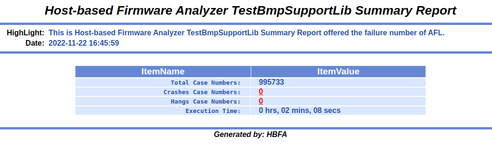
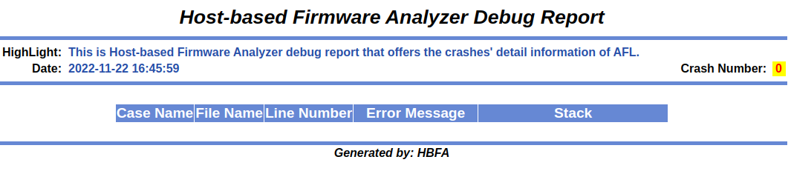
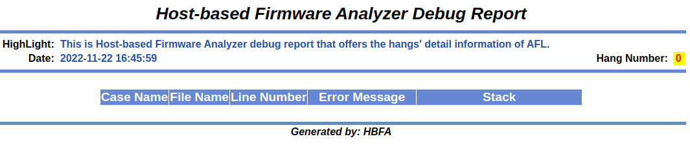
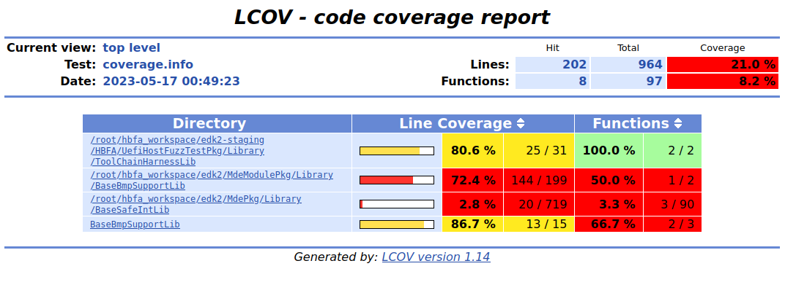
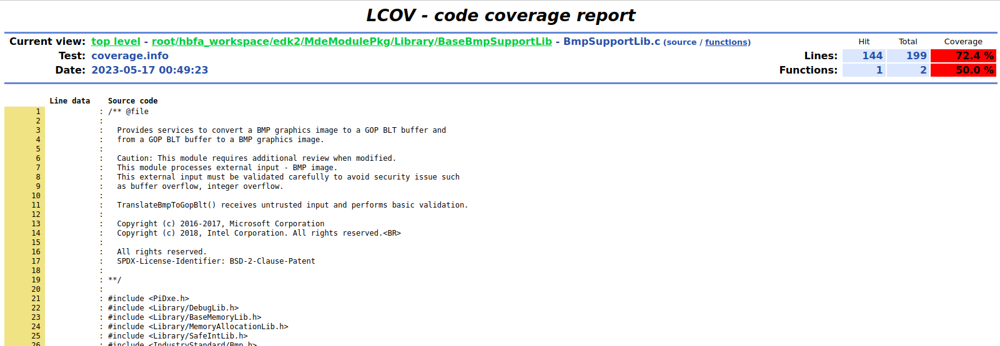

## Generating fuzzing summary and coverage data reports

HBFA includes two scripts to assist with generating fuzzing and coverage reports: 'ReportMain.py' and 'GenCodeCoverage.py', respectively. For AFL fuzzing runs, the underlying coverage format used by HBFA is GCOV-based, and the LCOV tool is used to generate HTML reports. For LibFuzzer results, GCOV-based can be generated, or, if the '-p' option was set to 'True' for RunLibFuzzer.py, LLVM [source-based coverage](https://clang.llvm.org/docs/SourceBasedCodeCoverage.html) (Profraw-based) coverage reports can be generated. In the following, we'll step through examples for both GCOV-based- and Profraw-based- reports.

### Generating fuzzing reports for AFL fuzzing output, GCOV-based

We again use the TestBmpSupportLib test-case for the example. In order to generate the reports from our previous fuzzing session with RunAFL.py with the TestBmpSupportLib test-case, we should first run the 'ReportMain.py' script. To run the script, several arguments are needed; first, running the help option will show the available arguments for this command.

```console
# ReportMain.py -h
usage: ReportMain.py [-h] [-e MODULEBIN] [-i RESULTPATH] [-r REPORTPATH] [-t TESTMETHODS] [-s SLEEPTIME]

options:
  -h, --help            show this help message and exit
  -e MODULEBIN, --execbinary MODULEBIN
                        Test module binary file name.
  -i RESULTPATH, --input RESULTPATH
                        Test result path for test method.
  -r REPORTPATH, --report REPORTPATH
                        Generated report path.
  -t TESTMETHODS, --testmethods TESTMETHODS
                        Test method's name. Must be one of [afl, libfuzzer]. Will be auto detected for default.
  -s SLEEPTIME, --sleep SLEEPTIME
                        In run time mode, # of seconds to sleep between checking for new seed files
```

For the test method, we will specify AFL, e.g. '-t afl'. Next, the fuzzing module binary should be specified (-e MODULEBIN). When we ran the RunAFL.py script, it also ensured that a separate build of the test case was done using GCC with GCOV coverage enabled; therefore, for the TestBmpSupportLib test-case this will be (your base directory may vary): '/root/hbfa_workspace/Build/UefiHostFuzzTestCasePkg/DEBUG_GCC5/X64/TestBmpSupportLib'. Further we will need to provide the directory (-i RESULTPATH) we had specified for our fuzzing output ('/tmp/fuzz_RunAFL_TestBmpSupportLib'). Lastly, we need to provide a location for the report output (-r REPORTPATH). Putting this together, we run the ReportMain.py command:

```console
# ReportMain.py -e /root/hbfa_workspace/Build/UefiHostFuzzTestCasePkg/DEBUG_GCC5/X64/TestBmpSupportLib -i /tmp/fuzz_RunAFL_TestBmpSupportLib -r /tmp/TestBmpSupportLib -t afl
```

The report contents will be output to the directory we specified: '/tmp/TestBmpSupportLib'. For this example, the following files are created, as shown in the directory listing.

```console
# ls /tmp/TestBmpSupportLib/DebugReport/
GdbSummaryReport.html  IndexCrashes.html  IndexHangs.html
```

The file 'GdbSummaryReport.html' will contain an overview of the AFL fuzzing run (e.g. total case numbers, execution time). The file 'IndexCrashes.html', should contain information for detected crashes; note, if there were no crashes, then the table of cases will be empty. Example outputs for this are shown in the following.



*Example GdbSummaryReport.html report with no crashes*



*Example IndexCrashes.html report with no crashes*



*Example IndexHangs.html report with no crashes*

### Generating a Fuzzing Code Coverage Report for AFL fuzzing output, GCOV-based

In order to generate code coverage report data, the 'GenCodeCoverage.py' script should be used. Running the help option will show the available arguments for this command:

```console
# GenCodeCoverage.py -h
Usage: python GenCodeCoverage.py [options][argument]

Copyright (c) 2019, Intel Corporation. All rights reserved.

Options:
  --version             show program's version number and exit
  -h, --help            show this help message and exit
  -e MODULEBIN, --execbinary=MODULEBIN
                        Test module binary file name.
  -d SEEDPATH, --dir=SEEDPATH
                        Test output seed directory path.
  -t TESTINIPATH, --testini=TESTINIPATH
                        Test ini files path for ErrorInjection, only for
                        ErrorInjection.
  -r REPORTPATH, --report=REPORTPATH
                        Generated code coverage report path.
```

As was done when executing 'ReportMain.py', we'll again specify the '-e' option (MODULEBIN) as: '/root/hbfa_workspace/Build/UefiHostFuzzTestCasePkg/DEBUG_GCC5/X64/TestBmpSupportLib'. Importantly, the '-d' option for SEEDPATH will be the 'queue' directory in the AFL fuzzing output '/tmp/fuzz_RunAFL_TestBmpSupportLib/queue', as this will contain representative input files to reach all of the code paths discovered during the fuzzing session. Lastly, the '-t' option is will not be needed (for ErrorInjection), and we'll specify our report output directory for the '-r' (REPORTPATH) argument. Putting this together and running the command:

```console
# GenCodeCoverage.py -e /root/hbfa_workspace/Build/UefiHostFuzzTestCasePkg/DEBUG_GCC5/X64/TestBmpSupportLib -d /tmp/fuzz_RunAFL_TestBmpSupportLib/queue -r /tmp/TestBmpSupportLib/
Capturing coverage data from /root/hbfa_workspace/Build/UefiHostFuzzTestCasePkg/DEBUG_GCC5/X64
Found gcov version: 11.3.1
Using intermediate gcov format
Scanning /root/hbfa_workspace/Build/UefiHostFuzzTestCasePkg/DEBUG_GCC5/X64 for .gcda files ...
Found 15 data files in /root/hbfa_workspace/Build/UefiHostFuzzTestCasePkg/DEBUG_GCC5/X64
Processing UefiHostFuzzTestPkg/Library/ToolChainHarnessLib/ToolChainHarnessLib/OUTPUT/ToolChainHarnessLib.gcda
Processing MdePkg/Library/BaseSafeIntLib/BaseSafeIntLib/OUTPUT/SafeIntLib.gcda
Processing UefiHostTestPkg/Library/BaseLibHost/BaseLibHost/OUTPUT/SwapBytes32.gcda
Processing UefiHostTestPkg/Library/BaseLibHost/BaseLibHost/OUTPUT/RShiftU64.gcda
Processing UefiHostTestPkg/Library/BaseLibHost/BaseLibHost/OUTPUT/CpuBreakpointGcc.gcda
Processing UefiHostTestPkg/Library/BaseLibHost/BaseLibHost/OUTPUT/LShiftU64.gcda
Processing UefiHostTestPkg/Library/BaseLibHost/BaseLibHost/OUTPUT/MultS64x64.gcda
Processing UefiHostTestPkg/Library/BaseLibHost/BaseLibHost/OUTPUT/MultU64x64.gcda
Processing UefiHostTestPkg/Library/BaseLibHost/BaseLibHost/OUTPUT/SwapBytes16.gcda
Processing UefiHostTestPkg/Library/BaseLibHost/BaseLibHost/OUTPUT/Math64.gcda
Processing UefiHostTestPkg/Library/BaseMemoryLibHost/BaseMemoryLibHost/OUTPUT/BaseMemoryLibHost.gcda
Processing UefiHostTestPkg/Library/MemoryAllocationLibHost/MemoryAllocationLibHost/OUTPUT/MemoryAllocationLibHost.gcda
Processing UefiHostTestPkg/Library/DebugLibHost/DebugLibHost/OUTPUT/DebugLibHost.gcda
Processing MdeModulePkg/Library/BaseBmpSupportLib/BaseBmpSupportLib/OUTPUT/BmpSupportLib.gcda
Processing UefiHostFuzzTestCasePkg/TestCase/MdeModulePkg/Library/BaseBmpSupportLib/TestBmpSupportLib/OUTPUT/TestBmpSupportLib.gcda
Finished .info-file creation
Reading tracefile coverage.info
Removing /root/hbfa_workspace/hbfa-fl/HBFA/UefiHostTestPkg/Library/BaseLibHost/CpuBreakpointGcc.c
Removing /root/hbfa_workspace/hbfa-fl/HBFA/UefiHostTestPkg/Library/BaseLibHost/LShiftU64.c
Removing /root/hbfa_workspace/hbfa-fl/HBFA/UefiHostTestPkg/Library/BaseLibHost/Math64.c
Removing /root/hbfa_workspace/hbfa-fl/HBFA/UefiHostTestPkg/Library/BaseLibHost/MultS64x64.c
Removing /root/hbfa_workspace/hbfa-fl/HBFA/UefiHostTestPkg/Library/BaseLibHost/MultU64x64.c
Removing /root/hbfa_workspace/hbfa-fl/HBFA/UefiHostTestPkg/Library/BaseLibHost/RShiftU64.c
Removing /root/hbfa_workspace/hbfa-fl/HBFA/UefiHostTestPkg/Library/BaseLibHost/SwapBytes16.c
Removing /root/hbfa_workspace/hbfa-fl/HBFA/UefiHostTestPkg/Library/BaseLibHost/SwapBytes32.c
Removing /root/hbfa_workspace/hbfa-fl/HBFA/UefiHostTestPkg/Library/BaseMemoryLibHost/BaseMemoryLibHost.c
Removing /root/hbfa_workspace/hbfa-fl/HBFA/UefiHostTestPkg/Library/DebugLibHost/DebugLibHost.c
Removing /root/hbfa_workspace/hbfa-fl/HBFA/UefiHostTestPkg/Library/MemoryAllocationLibHost/MemoryAllocationLibHost.c
Deleted 11 files
Writing data to coverage.info
Summary coverage rate:
  lines......: 21.0% (202 of 964 lines)
  functions..: 8.2% (8 of 97 functions)
  branches...: no data found
Reading data file coverage.info
Found 4 entries.
Found common filename prefix "/root/hbfa_workspace/hbfa-fl/HBFA/UefiHostFuzzTestCasePkg/TestCase/MdeModulePkg/Library"
Writing .css and .png files.
Generating output.
Processing file BaseBmpSupportLib/TestBmpSupportLib.c
Processing file /root/hbfa_workspace/hbfa-fl/HBFA/UefiHostFuzzTestPkg/Library/ToolChainHarnessLib/ToolChainHarnessLib.c
Processing file /root/hbfa_workspace/edk2/MdeModulePkg/Library/BaseBmpSupportLib/BmpSupportLib.c
Processing file /root/hbfa_workspace/edk2/MdePkg/Library/BaseSafeIntLib/SafeIntLib.c
Writing directory view page.
Overall coverage rate:
  lines......: 21.0% (202 of 964 lines)
  functions..: 8.2% (8 of 97 functions)
Please view code coverage report in /tmp/TestBmpSupportLib/CodeCoverageReport
```

The output (coverage report) is written to '/tmp/TestBmpSupportLib/CodeCoverageReport'. Examining the directory contents, one can see that an HTML-based report is generated (e.g. see index.html).

```console
# ls /tmp/TestBmpSupportLib/CodeCoverageReport/
BaseBmpSupportLib  emerald.png  glass.png          index-sort-l.html  root      snow.png
amber.png          gcov.css     index-sort-f.html  index.html         ruby.png  updown.png
```

An example of the coverage output is shown in the following screenshots.



*Example index.html code coverage report*



*Example code coverage report for BmpSupportLib.c (drill down into source code view from index.html)*

### Generating a Fuzzing and Coverage Report for LibFuzzer-base fuzzing in HBFA-FL

Fuzzing session summary and coverage reports can be generated using 'ReportMain.py' and 'GenCodeCoverage.py' as was done in the previous cases for fuzzing with AFL; however, coverage reports can be also processed for LLVM, Profraw-based output (in addition to LCOV-based output). Noting that for the LLVM, Profraw-based output it is necessary that the 'RunLibFuzzer.py' script was ran with the '-p' option set to 'True'. (Also you may wish to set the LLVM_PROFILE_FILE environment variable to control where the Profraw coverage data is emitted).

### Generating a Fuzzing Session Summary Report

A summary report for the fuzzing session can be generated by using the 'ReportMain.py' script, as shown:

```console
# ReportMain.py -e /root/hbfa_workspace/Build/UefiHostFuzzTestCasePkg/DEBUG_LIBFUZZER/X64/TestBmpSupportLib -i /tmp/fuzz_RunLibFuzzer_TestBmpSupportLib -r /tmp/TestBmpSupportLib -t libfuzzer 
```

Note, '-i' points to the artifacts (seed) directory from running the built, LibFuzzer test-case binary and '-t' is the target type (here  'libfuzzer').

The report contents will be output to the directory specified (with the '-r' argument, here /tmp/TestBmpSupportLib). For this example, the following files are created (shown in a directory listing).

```console
# ls /tmp/TestBmpSupportLib/DebugReport/
IndexSanitizer.html  SanitizerSummaryReport.html
```

If there are no crashes, the reports will indicate 0 crashes. In the event a sanitizer records a crash, a report may not be generated, instead a sanitizer log file may be written to the report directory, as shown in the following directory listing.

```console
bash-5.1# ls /tmp/TestBmpSupportLib/DebugReport/
HBFA.Sanitizer.log
```

### Generating a Fuzzing Code Coverage Report for output from LibFuzzer

The GenCodeCoverage.py script is used to generate code coverage reports. Again, the HBFA-FL release can process the coverage data in two ways:

1. The original HBFA way for LibFuzzer, using the GCC5 build target to process seed/corpus files (the original files, along with those written during the previous run of LibFuzzer), and then post processing those into a HTML-formatted report (leveraging the LCOV program)
2. The test-case is compiled such that source-based coverage data can be emitted ('PROFRAW' data is collected). When the GenCodeCoverage.py script is invoked and the target binary was built using the LIBFUZZER target, the seed/corpus files will be used, along with llvm-cov suite of tools to generate coverage report files.

#### 1. LCOV-based coverage output

In order to generate code coverage report data, the 'GenCodeCoverage.py' script should be used; the use will be similar as that done for the AFL version.

```console
# GenCodeCoverage.py -e /root/hbfa_workspace/Build/UefiHostFuzzTestCasePkg/DEBUG_GCC5/X64/TestBmpSupportLib -d /root/hbfa_workspace/hbfa-fl/HBFA/UefiHostFuzzTestCasePkg/Seed/BMP/Raw -r /tmp/TestBmpSupportLib/
Capturing coverage data from /root/hbfa_workspace/Build/UefiHostFuzzTestCasePkg/DEBUG_GCC5/X64
Found gcov version: 11.3.1
Using intermediate gcov format
Scanning /root/hbfa_workspace/Build/UefiHostFuzzTestCasePkg/DEBUG_GCC5/X64 for .gcda files ...
Found 15 data files in /root/hbfa_workspace/Build/UefiHostFuzzTestCasePkg/DEBUG_GCC5/X64
Processing UefiHostFuzzTestPkg/Library/ToolChainHarnessLib/ToolChainHarnessLib/OUTPUT/ToolChainHarnessLib.gcda
...
Writing data to coverage.info
Summary coverage rate:
  lines......: 20.4% (197 of 964 lines)
  functions..: 8.2% (8 of 97 functions)
  branches...: no data found
Reading data file coverage.info
Found 4 entries.
Found common filename prefix "/root/hbfa_workspace/hbfa-fl/HBFA/UefiHostFuzzTestCasePkg/TestCase/MdeModulePkg/Library"
Writing .css and .png files.
Generating output.
Processing file BaseBmpSupportLib/TestBmpSupportLib.c
Processing file /root/hbfa_workspace/hbfa-fl/HBFA/UefiHostFuzzTestPkg/Library/ToolChainHarnessLib/ToolChainHarnessLib.c
Processing file /root/hbfa_workspace/edk2/MdeModulePkg/Library/BaseBmpSupportLib/BmpSupportLib.c
Processing file /root/hbfa_workspace/edk2/MdePkg/Library/BaseSafeIntLib/SafeIntLib.c
Writing directory view page.
Overall coverage rate:
  lines......: 20.4% (197 of 964 lines)
  functions..: 8.2% (8 of 97 functions)
Please view code coverage report in /tmp/TestBmpSupportLib/CodeCoverageReport
```

The output will be collected in the sub-directory 'CodeCoverageReport' of the report directory specified via the '-r' argument for the GenCodeCoverage.py script. An example of the output is shown in the following.

```console
# ls /tmp/TestBmpSupportLib/CodeCoverageReport/
BaseBmpSupportLib  emerald.png  glass.png          index-sort-l.html  root      snow.png
amber.png          gcov.css     index-sort-f.html  index.html         ruby.png  updown.png
```

When opened in a web-browser, the coverage information presented should be similar to that shown in previous examples shown for AFL code coverage output.

#### 2. LLVM-based coverage output

The LLVM-based (profraw data) coverage report can be produced in similar manner by running the 'GenCodeCoverage.py' script. Here, it is essential that the 'RunLibFuzzer.py' script was invoked using the '-p' option set to True, so that the proper coverage instrumentation (and emitted output) will have been generated during the fuzzing session. Assuming all of this has been done, the coverage report can be generated running the following command for our test-case.

```console
# GenCodeCoverage.py -e /root/hbfa_workspace/Build/UefiHostFuzzTestCasePkg/DEBUG_LIBFUZZER/X64/TestBmpSupportLib -d /root/hbfa_workspace/hbfa-fl/HBFA/UefiHostFuzzTestCasePkg/Seed/BMP/Raw -r /tmp/TestBmpSupportLib/
INFO: Running with entropic power schedule (0xFF, 100).
INFO: Seed: 1478178115
INFO: Loaded 1 modules   (754 inline 8-bit counters): 754 [0x4b64a8, 0x4b679a), 
INFO: Loaded 1 PC tables (754 PCs): 754 [0x4993b8,0x49c2d8), 
/root/hbfa_workspace/Build/UefiHostFuzzTestCasePkg/DEBUG_LIBFUZZER/X64/TestBmpSupportLib: Running 1 inputs 1 time(s) each.
Running: /root/hbfa_workspace/hbfa-fl/HBFA/UefiHostFuzzTestCasePkg/Seed/BMP/Raw/sample.bmp
Executed /root/hbfa_workspace/hbfa-fl/HBFA/UefiHostFuzzTestCasePkg/Seed/BMP/Raw/sample.bmp in 0 ms
***
*** NOTE: fuzzing was not performed, you have only
***       executed the target code on a fixed set of inputs.
***
INFO: Running with entropic power schedule (0xFF, 100).
INFO: Seed: 1488500083
INFO: Loaded 1 modules   (754 inline 8-bit counters): 754 [0x4b64a8, 0x4b679a), 
INFO: Loaded 1 PC tables (754 PCs): 754 [0x4993b8,0x49c2d8), 
/root/hbfa_workspace/Build/UefiHostFuzzTestCasePkg/DEBUG_LIBFUZZER/X64/TestBmpSupportLib: Running 1 inputs 1 time(s) each.
...
```

The output will be collected in the sub-directory 'llvm_coverage_report' of the report directory specified via the '-r' argment for the GenCodeCoverage.py script.

```console
# ls /tmp/TestBmpSupportLib/llvm_coverage_report/
default.profdata  filtered.txt	report.html  report.txt  show.txt
```

[&lt;&lt;](./fuzzingwithLibFuzzer.md) Back | Return to [Summary](../SUMMARY.md)