# HBFA-FL: Writing a fuzzing harness

For this tutorial, we will be examining an example UEFI driver and how we can develop a fuzzing harness in HBFA-FL to find issues with the driver. Specifically, the fuzzing test harness for HBFA will be for fuzzing with LibFuzzer (and AFL). To do this, we will first examine an example UEFI driver, modify this driver to introduce a few vulnerabilities/issues. Following this, we will examine how to go about developing a fuzzing harness in HBFA-FL and discovering the issues.

## Table of Contents

- [HBFA-FL: Writing a fuzzing harness](#hbfa-fl-writing-a-fuzzing-harness)
  - [Table of Contents](#table-of-contents)
  - [Setting up an HBFA-FL environment for this tutorial](#setting-up-an-hbfa-fl-environment-for-this-tutorial)
    - [Setting up and environment for running the HelloWorld.efi driver from an UEFI shell](#setting-up-and-environment-for-running-the-helloworldefi-driver-from-an-uefi-shell)
      - [Running QEMU and accessing the UEFI shell](#running-qemu-and-accessing-the-uefi-shell)
  - [Edk2 HelloWorld application example - Building the application](#edk2-helloworld-application-example---building-the-application)
    - [Edk2 HelloWorld application example - Running the application (optional)](#edk2-helloworld-application-example---running-the-application-optional)
  - [Extending the UEFI driver and creating a HelloWorldLib library](#extending-the-uefi-driver-and-creating-a-helloworldlib-library)
    - [Files that we will be modifying or creating when extending the HelloWorld Driver](#files-that-we-will-be-modifying-or-creating-when-extending-the-helloworld-driver)
    - [Files that we will be modifying or creating for HelloWorldLib Library](#files-that-we-will-be-modifying-or-creating-for-helloworldlib-library)
    - [HelloWorld.c: Examining the code](#helloworldc-examining-the-code)
      - [Additions to source-code](#additions-to-source-code)
    - [HelloWorld.inf: Examining the source](#helloworldinf-examining-the-source)
    - [HelloWorldLib: Examining the source code](#helloworldlib-examining-the-source-code)
      - [HelloWorldLib.c: Examining the source code](#helloworldlibc-examining-the-source-code)
      - [HelloWorldLib.inf: Examining the source code](#helloworldlibinf-examining-the-source-code)
      - [HelloWorldLib.h: Examining the source code](#helloworldlibh-examining-the-source-code)
    - [Updates: Adding a reference to HelloWorldLib in the platform file EmulatorPkg.dsc](#updates-adding-a-reference-to-helloworldlib-in-the-platform-file-emulatorpkgdsc)
  - [Building the HelloWorld UEFI shell program](#building-the-helloworld-uefi-shell-program)
      - [Verifying the bug in a UEFI shell (optional)](#verifying-the-bug-in-a-uefi-shell-optional)
  - [TestHelloWorld: Creating a fuzzing test harnesses in HBFA](#testhelloworld-creating-a-fuzzing-test-harnesses-in-hbfa)
    - [Where to create and save a fuzzing test case harness](#where-to-create-and-save-a-fuzzing-test-case-harness)
    - [Whats needed in the fuzzing harness files (.c and .inf)?](#whats-needed-in-the-fuzzing-harness-files-c-and-inf)
      - [The fuzzing harness test logic (C-source code file)](#the-fuzzing-harness-test-logic-c-source-code-file)
      - [The module description file (INF file)](#the-module-description-file-inf-file)
  - [Developing a fuzzing harness for HelloWorldLib](#developing-a-fuzzing-harness-for-helloworldlib)
    - [Files that we will be modifying or creating when creating the fuzzing harness, TestHelloWorld](#files-that-we-will-be-modifying-or-creating-when-creating-the-fuzzing-harness-testhelloworld)
    - [TestHelloWorld.c: Examining the source code](#testhelloworldc-examining-the-source-code)
    - [TestHelloWorld.inf: Examining the source code](#testhelloworldinf-examining-the-source-code)
    - [UefiHostTestPkg.dsc: Examining the source code](#uefihosttestpkgdsc-examining-the-source-code)
  - [Building the TestHelloWorld fuzzing harness](#building-the-testhelloworld-fuzzing-harness)
    - [Using the 'Build' command](#using-the-build-command)
    - [Using the HBFA helper scripts](#using-the-hbfa-helper-scripts)
  - [Fuzzing HelloWorldLib for vulnerabilities with LibFuzzer](#fuzzing-helloworldlib-for-vulnerabilities-with-libfuzzer)
    - [Reproducing the crash](#reproducing-the-crash)
    - [Debugging the crash](#debugging-the-crash)

## Setting up an HBFA-FL environment for this tutorial

For this tutorial is it necessary to have an environment setup for EDK2 and HBFA-FL. For this, we recommend installing HBFA-FL as described in the [HBFA-FL: A Quick Install Guide](). Optionally, you may set-up a separate environment where you can run the test/example driver (HelloWorld.efi) in an emulated UEFI shell. The set-up for these will leverage QEMU for the emulation and some details are included in the following sub-section.

### Setting up and environment for running the HelloWorld.efi driver from an UEFI shell

The following is an optional set-up and not required for fuzzing with HBFA. The following instructions demonstrate how to set-up the environment on an Ubuntu (22.04) desktop operating system; however, similar approaches can be used for other set-ups/configurations. Here, we will leverage the QEMU system emulator and a build Tianocore EDK2 OVMF UEFI image to provide access to a UEFI shell environment. When the HelloWorld.efi driver is built for the tutorial, the application should be copied from the HBFA build environment to a location accessible from the emulated (QEMU) UEFI shell environment. From there, you can run and interact with the driver. Further, this will provide an environment where you can confirm operation of the driver, as well as allow for you to test any modifications, etc.

1. Assuming an Ubuntu 22.04 environment, ensure that the appropriate package is installed for Qemu (e.g. the 'qemu-kvm' package). Ensure that the 'qemu-system-x86_64' is available.
2. Next, you will need a copy of the Tianocore EDK II [OVMF](https://github.com/tianocore/tianocore.github.io/wiki/OVMF-FAQ) firmware image. The is included in EDK II and can be built within that environment. However, the package management system for most main-line Linux distributions will include a pre-built image. For Ubuntu 22.04, this package is 'ovmf'. Therefore a simple 'apt install ovmf' should complete and installation of the firmware. The installation should place a copy of the firmware at the following location: /usr/share/ovmf/OVMF.fd.
3. Last, download and have a suitable operating system ISO. Here we'll use the Ubuntu 22.04 Desktop ISO from [Ubuntu](https://ubuntu.com/download/desktop).

#### Running QEMU and accessing the UEFI shell

Assuming the above set-up has been completed, the following command can be used to run the emulated environment.

```console
$ qemu-system-x86_64 -bios /usr/share/ovmf/OVMF.fd -cdrom ~/Downloads/ubuntu-22.04.2-desktop-amd64.iso -hda fat:./share,format=directory
```

Importantly, the OVMF.fd image is used (specified via the '-bios' parameter). Additionally, the '-cdrom' option is used to specify the location for the Ubuntu 22.04 ISO image. Last, in this example a directory 'share' located in the run directory is used. When invoked ine the manner shown, the folder will be presented to the emulated system as a FAT32-formatted disk containing the files saved in the directory. In this case, you will copy the built HelloWorld.efi binary to this location and the file will be accessible from a file system accessible in the UEFI shell.

When the previous command is ran, you should be presented with a Tianocore splash screen followed by the GNU GRUB boot loader (as shown in the following image). From this point, we'll step a few menus and ultimately to gain access to the UEFI shell.

<figure>
    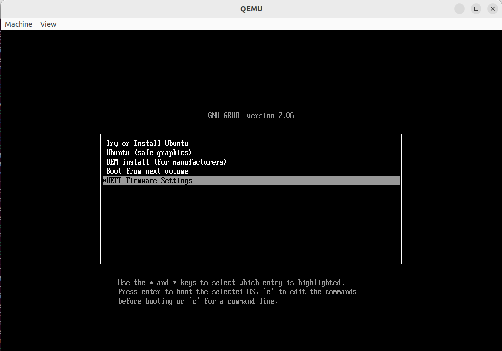
    <figcaption>Example of Grub boot loader presented from booting of Ubuntu 22.04 ISO image under QEMU.</figcaption>
</figure>

From the GRUB bootloader, select ``UEFI Firmware Settings``. Following this, you will be presented with the UEFI settings screen. From there you should select ``Boot Manager`` as shown in the following.

<figure>
    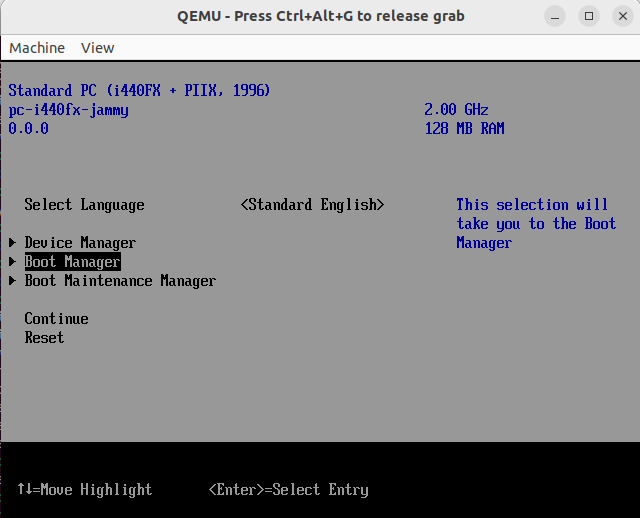
    <figcaption>From the 'UEFI Firmware Settings' (accessed from Grub), selecting the Boot Manager option.</figcaption>
</figure>

Once you have entered the  ``Boot Manager``, there is an option available to select ``EFI Internal Shell`` (as shown in the following screenshot).

<figure>
    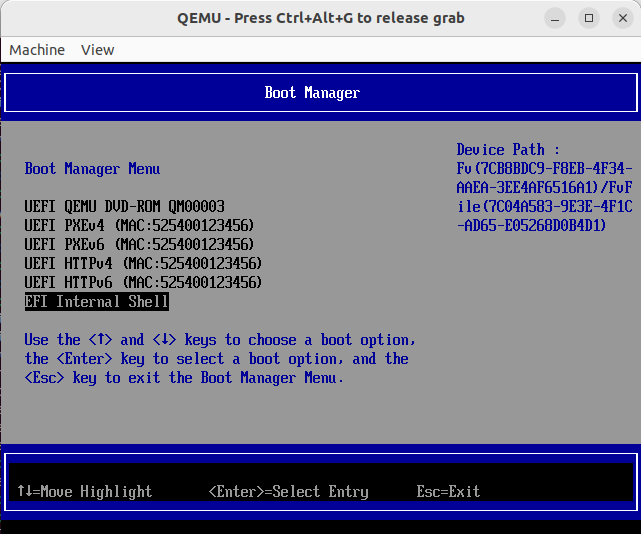
    <figcaption>A view of the Boot Manager Menu. An interactive UEFI shell can be accessed via the 'EFI Internal Shell' option.</figcaption>
</figure>

Once you have selected the EFI shell, you will be presented with an interactive UEFI shell. Noting you will need to press the 'Escape' key before the timer expires. You should see a shell console similar to that shown in the following screenshot.

<figure>
    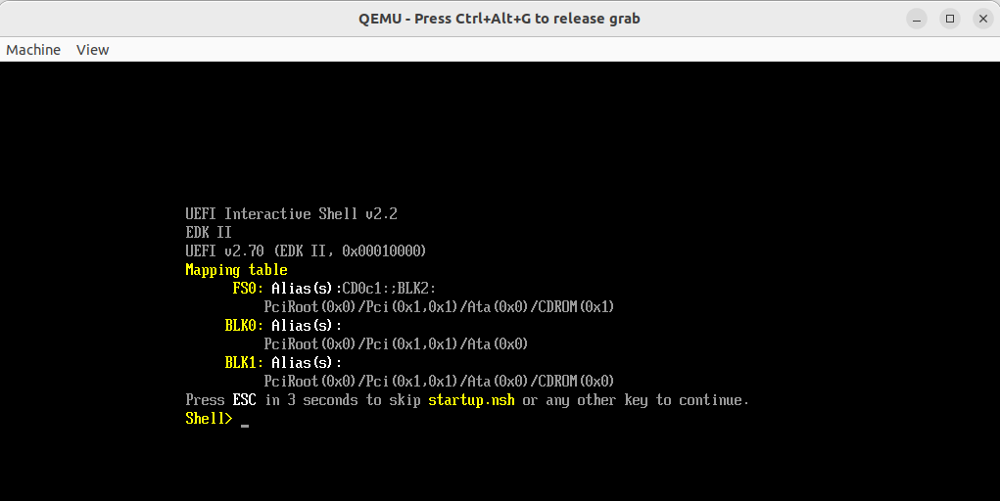
    <figcaption>A view of the UEFI Interactive Shell console.</figcaption>
</figure>

## Edk2 HelloWorld application example - Building the application

Included in the Edk2 distribution is a [HelloWorld](https://github.com/tianocore/edk2/tree/master/MdeModulePkg/Application/HelloWorld) example driver application. This driver is intended to act as an example UEFI shell application, which will simply print "UEFI Hello World!" to the console when ran from a UEFI shell. We'll quickly cover building this application and then look at an example of it running in a UEFI shell.

First, the HelloWorld application can be found by examining the 'MdeModulePkg/Application/HelloWorld/' directory withing the edk2 source code. A listing of the directory from EDK II is shown in the following.

```console
[root@12a70ad5bf59 hbfa_workspace]# ls edk2/MdeModulePkg/Application/HelloWorld/
HelloWorld.c  HelloWorld.inf  HelloWorld.uni  HelloWorldExtra.uni  HelloWorldStr.uni
```

Two important files to take note of here are the ``HelloWorld.c`` and the ``HelloWorld.inf`` files. The ``HelloWorld.c`` file contains the source code and logic for the application. The ``HelloWorld.inf`` build description file is used by the EDK II build system for informing various dependencies and understanding the type of application being build. Don't worry, we'll dive into some more details on these files when we extend the functionality of this program. For now, we'll focus on simply building and verifying the program runs. Lastly, the '.uni' resource files are used as a resource for the text printed to the console

Compiling the HelloWorld application is relatively straightforward using the EDK II build system. From the 'edk2' directory we can invoke the EDK II 'build' command as shown:

```
[root@00c4495bd766 edk2]# build -m MdeModulePkg/Application/HelloWorld/HelloWorld.inf -a X64 -b DEBUG -t GCC5
```

Here, the '-m' option is used for build description file for the module we are building (HelloWorld.inf); '-a' is used for the architecture ('X64'); '-b' is set as 'DEBUG', so that debugging symbols will be included; and '-t' is GCC5 so that the GCC compiler will be the target compiler used for the build. Behind the scenes, the [EmulatorPkg](https://github.com/tianocore/edk2/blob/master/EmulatorPkg/Readme.md) platform is used. This is noted, as we'll need to add some updates to the platform description file when we extend the functionality of the HelloWorld application. When the build is complete, you should see a file ``HelloWorld.efi``, as shown in the following file listing from the 'Build/EmulatorX64/DEBUG_GCC5/X64/MdeModulePkg/Application/HelloWorld/HelloWorld/OUTPUT/'. Note, the 'Build' directory will be 

```
[root@00c4495bd766 OUTPUT]# ls
AutoGen.obj       HelloWorld.lib       HelloWorld.txt         HelloWorldhii.lib
AutoGen.obj.deps  HelloWorld.map       HelloWorld.uni         HelloWorldhii.rc
HelloWorld.efi    HelloWorld.obj       HelloWorldExtra.uni    object_files.lst
HelloWorld.inf    HelloWorld.obj.deps  HelloWorldStrDefs.hpk  static_library_files.lst
```

### Edk2 HelloWorld application example - Running the application (optional)

If you wish to verify that the HelloWorld.efi application is working, you can  take the approach outlined in the section: [Running the QEMU and accessing the UEFI shell](#running-the-qemu-and-accessing-the-uefi-shell). Here, you need to copy the ``HelloWorld.efi`` program into the directory you wish to share as a FAT partition before starting QEMU. Once you have accessed the shell, you should see a console input similar to the following.

<figure>
    
    <figcaption>A view of the UEFI Interactive Shell console.</figcaption>
</figure>

You can list the mapped file systems by running the 'map' command as shown in the following figure.

<figure>
    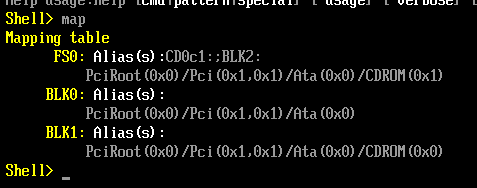
    <figcaption>Using the 'map' command to list file systems in UEFI shell.</figcaption>
</figure>

If you type the file system name from the mapping table (e.g. 'FS0:'), then the current working directory will be changed to that location. As shown in the following, we have switched to 'FS0:' and we list the contents of the file system with the 'ls' command. Here you can see the ``HelloWorld.efi`` application in the output.

<figure>
    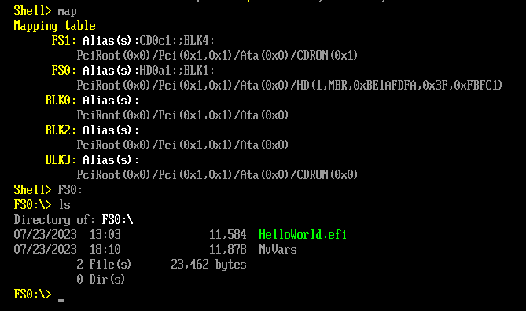
    <figcaption>Changing to 'FS0:' and using the 'ls' command to list files, showing the 'HelloWorld.efi' file.</figcaption>
</figure>

Last, the application can be ran by simply typing the name the application (file name) ``HelloWorld.efi``. As anticipated, the program will print the text 'UEFI Hello World!' to the console, as shown in the following figure.

<figure>
    
    <figcaption>Running the 'HelloWorld.efi' application from the UEFI shell.</figcaption>
</figure>

## Extending the UEFI driver and creating a HelloWorldLib library

We will extend the UEFI driver, adding functionality to read and process arguments from the UEFI shell command-line. Importantly, the functionality we add will introduce a stack overflow vulnerability. To do this, will create a HelloWorldLib library that will process the first argument read in by the HelloWorld application. Later in this tutorial, we will develop a fuzzing harness for the HelloWorldLib library to fuzz and find this vulnerability. Firstly, a few tables are included to provide an overview of what files we'll need to modify or create when extending HelloWorld and adding our HelloWorldLib library. A relative path/location from the edk2 source code folder is provided for each file presented.

### Files that we will be modifying or creating when extending the HelloWorld Driver

| Filename       | Description                                                                                                                                                                                                                                                    | File-Path (relative to /root/hbfa_workspace/) |
| -------------- | -------------------------------------------------------------------------------------------------------------------------------------------------------------------------------------------------------------------------------------------------------------- | --------------------------------------------- |
| HelloWorld.c   | The HelloWorld EFI application included with EDK2. This file is further modified to read/access arguments when invoked from the UEFI shell. Further, the file calls a function from HelloWorldLib that will process the first argument in a non-secure manner. | edk2/MdeModulePkg/Application/HelloWorld/     |
| HelloWorld.inf | The INF (build description file) for the HelloWorld application. When extending the functionality for this application (including additional libraries), the INF file must also be updated accordingly.                                                        | edk2/MdeModulePkg/Application/HelloWorld/     |

### Files that we will be modifying or creating for HelloWorldLib Library

| Filename          | Description                                                                                                                                                                                                                                                                                                                                                                                                                                                | File-Path (relative to /root/hbfa_workspace/) |
| ----------------- | ---------------------------------------------------------------------------------------------------------------------------------------------------------------------------------------------------------------------------------------------------------------------------------------------------------------------------------------------------------------------------------------------------------------------------------------------------------- | --------------------------------------------- |
| HelloWorldLib.c   | The library code. Here we add a vulnerable function that processes the first argument.                                                                                                                                                                                                                                                                                                                                                                     | edk2/MdeModulePkg/Library/HelloWorldLib/      |
| HelloWorldLib.inf | The INF (build description file) for the HelloWorldLib library.                                                                                                                                                                                                                                                                                                                                                                                            | edk2/MdeModulePkg/Library/HelloWorldLib/      |
| HelloWorldLib.h   | A corresponding header file for the HelloWorldLib.c file.                                                                                                                                                                                                                                                                                                                                                                                                  | edk2/MdeModulePkg/Include/Library/            |
| EmulatorPkg.dsc   | This is the platform we build our test driver for. Depending on the specific platform being targeted, you will need to update the appropriate platform description file. Here the[EmulatorPkg](https://github.com/tianocore/edk2/blob/master/EmulatorPkg/Readme.md) is used. One must add a reference to the HelloWorldLib library (providing a name and a relative path to the INF file). This is required for the build system to find available libraries. | edk2/EmulatorPkg/                             |

### HelloWorld.c: Examining the code

The modified source code for HelloWorld.c is shown in the following. Additionally, a figure is included to help highlight the areas where new code has been added.

<details>
  <summary>Source-code for HelloWorld.c </summary>

```c
/** @file

//
  This sample application bases on HelloWorld PCD setting
  to print "UEFI Hello World!" to the UEFI Console.

  Copyright (c) 2006 - 2018, Intel Corporation. All rights reserved.<BR>
  SPDX-License-Identifier: BSD-2-Clause-Patent

**/

#include <Uefi.h>
#include <Library/PcdLib.h>
#include <Library/UefiLib.h>
#include <Library/UefiBootServicesTableLib.h>
#include <Library/UefiApplicationEntryPoint.h>
#include <Library/HelloWorldLib.h>
#include <Protocol/ShellParameters.h>

//
// String token ID of help message text.
// Shell supports to find help message in the resource section of an application image if
// .MAN file is not found. This global variable is added to make build tool recognizes
// that the help string is consumed by user and then build tool will add the string into
// the resource section. Thus the application can use '-?' option to show help message in
// Shell.
//
GLOBAL_REMOVE_IF_UNREFERENCED EFI_STRING_ID  mStringHelpTokenId = STRING_TOKEN (STR_HELLO_WORLD_HELP_INFORMATION);


/**
  The user Entry Point for Application. The user code starts with this function
  as the real entry point for the application.

  @param[in] ImageHandle    The firmware allocated handle for the EFI image.
  @param[in] SystemTable    A pointer to the EFI System Table.

  @retval EFI_SUCCESS       The entry point is executed successfully.
  @retval other             Some error occurs when executing this entry point.

**/
EFI_STATUS
EFIAPI
UefiMain (
  IN EFI_HANDLE        ImageHandle,
  IN EFI_SYSTEM_TABLE  *SystemTable
  )
{
  UINT32  Index;

  Index = 0;

  EFI_STATUS                     Status;
  EFI_SHELL_PARAMETERS_PROTOCOL  *ShellParameters;

  Status = gBS->HandleProtocol(
       ImageHandle,
       &gEfiShellParametersProtocolGuid,
       (VOID **) &ShellParameters
       );


  if (Status == EFI_SUCCESS)
  {
      for(int i=0; i<ShellParameters->Argc; i++) 
      {
         Print(L"Argv[%d]: %s\n", i, ShellParameters->Argv[i]);
      }

  }       

  
// Shell supports to find help message in the resource section of an application image if
// .MAN file is not found. This global variable is added to make build tool recognizes

  //
  // Three PCD type (FeatureFlag, UINT32 and String) are used as the sample.
  //
  if (FeaturePcdGet (PcdHelloWorldPrintEnable)) {
    for (Index = 0; Index < PcdGet32 (PcdHelloWorldPrintTimes); Index++) {
      //
      // Use UefiLib Print API to print string to UEFI console
      //
      Print ((CHAR16 *)PcdGetPtr (PcdHelloWorldPrintString));
    }
  }


  if (Status == EFI_SUCCESS)
  {
      // Process first argument from UEFL Shell if there is an argument
      if (ShellParameters->Argc > 1)
      {
         ProcessArgument(ShellParameters);
      }
    
  }

  return EFI_SUCCESS;
  Print( L"S\n");
}
```

</details>

#### Additions to source-code

The updates to the source are shown in the Figure below. In the section labeled A, we can see two additional file includes have been added. The first is for our HelloWorldLib library source. We'll be calling a function from that library ('ProcessArgument()') which will be used to process the first argument provided to our application. (The call to ProcessArgument is made in the part labeled C in the Figure.). Additionally, we include the ``ShellParameters.h`` file, which will give us access to the necessary interface and structures for accessing the command-line arguments for our application. For additional information on related interfaces and structures in the UEFI shell, see the [UEFI Shell Specification](https://uefi.org/sites/default/files/resources/UEFI_Shell_2_2.pdf).

For the section labeled B, this part defines a reference to a EFI_SHELL_PARAMETERS_PROTOCOL structure (ShellParameters), which once it is populated will contain references to the Argv array of command line arguments. To populate the ShellParameters structure, we access it via a call to ``gBS->HandleProtocol`` to ensure the Shell Parameters Protocol is supported/accessible. (For more details about UEFI Protocol Handler Services and Protocol Interface Functions, see the [UEFI specification documentation](https://uefi.org/specs/UEFI/2.10/07_Services_Boot_Services.html#protocol-handler-services) and the [UEFI Shell Specification](https://uefi.org/sites/default/files/resources/UEFI_Shell_2_2.pdf) documents). Once we have the reference to the EFI_SHELL_PARAMETERS_PROTOCOL structure, it is straightforward to access the Argc and Argv parameters. Here, we loop through the arguments and they are printed to the screen.

Last, in the section labeled C, if the number of arguments (Argc) is greater than 1 (ensuring we have a command-line argument to process), we then call the ``ProcessArgument`` function from HelloWorldLib, passing the reference to an EFI_SHELL_PARAMETERS_PROTOCOL structure (ShellParameters).

<figure>
    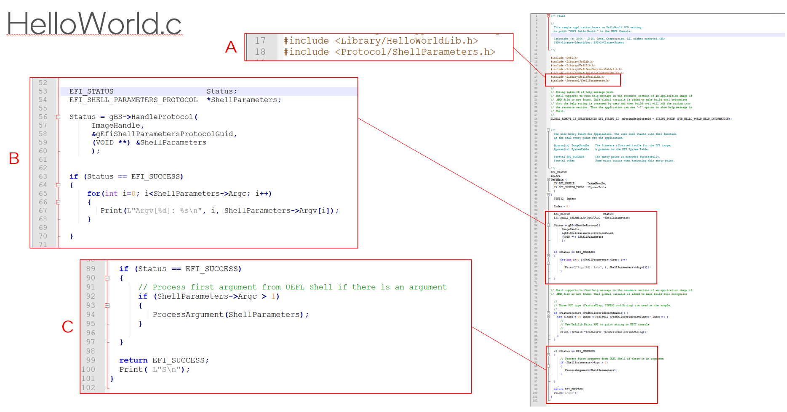
    <figcaption>Code added to HelloWorld.c (highlighted in red boxes).</figcaption>
</figure>

### HelloWorld.inf: Examining the source

The modified source code for the build-description file HelloWorld.inf is shown in the following. Here, we simply need to add an entry for the HelloWorldLib in the ``[LibrariesClasses]`` section for the file. Note: if you want to learn a little more about the INF file, jump ahead to the section: [The module description file (INF file)](#the-module-description-file-inf-file)

<details>
  <summary> Source-code for HelloWorld.inf </summary>

```ini
## @file
#  Sample UEFI Application Reference EDKII Module.
#
#  This is a sample shell application that will print "UEFI Hello World!" to the
#  UEFI Console based on PCD setting.
#
#  It demos how to use EDKII PCD mechanism to make code more flexible.
#
#  Copyright (c) 2008 - 2018, Intel Corporation. All rights reserved.<BR>
#
#  SPDX-License-Identifier: BSD-2-Clause-Patent
#
#
##

[Defines]
  INF_VERSION                    = 0x00010005
  BASE_NAME                      = HelloWorld
  MODULE_UNI_FILE                = HelloWorld.uni
  FILE_GUID                      = 6987936E-ED34-44db-AE97-1FA5E4ED2116
  MODULE_TYPE                    = UEFI_APPLICATION
  VERSION_STRING                 = 1.0
  ENTRY_POINT                    = UefiMain

#
#  This flag specifies whether HII resource section is generated into PE image.
#
  UEFI_HII_RESOURCE_SECTION      = TRUE

#
# The following information is for reference only and not required by the build tools.
#
#  VALID_ARCHITECTURES           = IA32 X64 EBC
#

[Sources]
  HelloWorld.c
  HelloWorldStr.uni

[Packages]
  MdePkg/MdePkg.dec
  MdeModulePkg/MdeModulePkg.dec

[LibraryClasses]
  UefiApplicationEntryPoint
  UefiLib
  PcdLib
  HelloWorldLib

[FeaturePcd]
  gEfiMdeModulePkgTokenSpaceGuid.PcdHelloWorldPrintEnable   ## CONSUMES

[Pcd]
  gEfiMdeModulePkgTokenSpaceGuid.PcdHelloWorldPrintString   ## SOMETIMES_CONSUMES
  gEfiMdeModulePkgTokenSpaceGuid.PcdHelloWorldPrintTimes    ## SOMETIMES_CONSUMES

[UserExtensions.TianoCore."ExtraFiles"]
  HelloWorldExtra.uni

```

</details>

### HelloWorldLib: Examining the source code

For the HelloWorldLib, three new files need to be created:

1. HelloWorldLib.c
2. HelloWorldLib.inf and
3. HelloWorldLib.h.

The source for these files is included in the following sub-sections.

#### HelloWorldLib.c: Examining the source code

The source code for HelloWorldLib.c is included below. Noting the code is intentionally written to be non-secure. The ``ProcessArgument`` function is intended to be exposed and called from HelloWorld.c. This function takes a reference to a EFI_SHELL_PARAMETERS_PROTOCOL struct as its argument. A character array is defined, which will be character array ``MyBuffer`` stored on the stack of fixed size. A crude implementation of a ``MyStrCpy`` is then used to copy the first argument (from the EFI_SHELL_PARAMETERS_PROTOCOL struct) into ``MyBuffer``.

<details>
  <summary>Source-code for HelloWorld.c </summary>

```c
/** @file

//
  This sample application bases on HelloWorld PCD setting
  to print "UEFI Hello World!" to the UEFI Console.

  Copyright (c) 2006 - 2018, Intel Corporation. All rights reserved.<BR>
  SPDX-License-Identifier: BSD-2-Clause-Patent

**/

#include <Uefi.h>
#include <Library/PcdLib.h>
#include <Library/UefiLib.h>
#include <Library/UefiBootServicesTableLib.h>
#include <Library/UefiApplicationEntryPoint.h>
#include <Protocol/ShellParameters.h>

int GetLen(const char *s)
{
   int len = 0;
   while ( 1 ) 
   {
      if ( (s[len] == 0x0) ) {
          if ( (s[len+1] == 0x0)) {
	      return len/2;
          }
      }
      len = len + 2;
   }
}

/**
  A dangerous copy function

**/
VOID MyStrCpy(char *dst, const char *src)
{
  int i = 0;
  int len = GetLen(src);
  Print(L"Length of string copy: %d\n", len);
  while (i < 2*len) 
  {
      *dst++ = *src++;
      i++;
  }
}

/**
  A vulnerable function that processes UEFI shell command-line arguments

  @param[in]  MyShellParameters     Shell parameters (arguments provided to HelloWorld.efi) as an EFI_SHELL_PARAMETERS_PROTOCOL structure.

**/
VOID ProcessArgument (
  IN  EFI_SHELL_PARAMETERS_PROTOCOL *MyShellParameters
  )
{
    char MyBuffer[16];
    MyStrCpy(MyBuffer, (char *)MyShellParameters->Argv[1]);
    Print(L"MyBuffer: %s\n", MyBuffer);
}

```

</details>

#### HelloWorldLib.inf: Examining the source code

The source code for HelloWorldLib.inf is included below. The file is based off of the original HelloWorld.inf. However, there are a few differences (items removed, changed, and added); the differences are described in the following table.

| INF Section                                 | Field           | Notes                                                                                                                                                                                                                           |
| ------------------------------------------- | --------------- | ------------------------------------------------------------------------------------------------------------------------------------------------------------------------------------------------------------------------------- |
| ``[Defines]``                               | BASE_NAME       | The basename is updated to HelloWorldLib.                                                                                                                                                                                       |
| ``[Defines]``                               | MODULE_UNI_FILE | This is removed.                                                                                                                                                                                                                |
| ``[Defines]``                               | FILE_GUID       | A unique value should be generated. For example, there are several[online](https://guidgenerator.com/) GUID generators that can be used.                                                                                           |
| ``[Defines]``                               | MODULE_TYPE     | This is updated to BASE (used for source code that is not tied to any specific execution environment, see this[document](https://github.com/tianocore-docs/edk2-InfSpecification/blob/master/appendix_f_module_types.md) for types |
| ``[Defines]``                               | ENTRY_POINT     | This is removed.                                                                                                                                                                                                                |
| ``[Defines]``                               | LIBRARY_CLASS   | This field is added and set to the library name 'HelloWorldLib'.                                                                                                                                                                |
| ``[Protocols]``                             | -               | A protocols section with a dependence on gEfiShellParametersProtocolGuid is added.                                                                                                                                              |
| ``[FeaturePcd]``                            | -               | This is removed.                                                                                                                                                                                                                |
| ``[Pcd]``                                   | -               | This is removed.                                                                                                                                                                                                                |
| ``[UserExtensions.TianoCore."ExtraFiles"]`` | -               | This is removed.                                                                                                                                                                                                                |
| ``[Sources]``                               | -               | This is updated and the only entry is to the library source file HelloWorldLib.c.                                                                                                                                               |

<details>
  <summary>Source-code for HelloWorldLib.inf </summary>

```ini
## @file
#  Sample UEFI Application Reference EDKII Module.
#
#  This is a sample shell application that will print "UEFI Hello World!" to the
#  UEFI Console based on PCD setting.
#
#  It demos how to use EDKII PCD mechanism to make code more flexible.
#
#  Copyright (c) 2008 - 2018, Intel Corporation. All rights reserved.<BR>
#
#  SPDX-License-Identifier: BSD-2-Clause-Patent
#
#
##

[Defines]
  INF_VERSION                    = 0x00010005
  BASE_NAME                      = HelloWorldLib
  FILE_GUID                      = 2e20917a-a9ab-4a19-99ba-4acb72a70f22
  VERSION_STRING                 = 1.0
  MODULE_TYPE                    = BASE
  LIBRARY_CLASS                  = HelloWorldLib

#
#  This flag specifies whether HII resource section is generated into PE image.
#
  UEFI_HII_RESOURCE_SECTION      = TRUE

#
# The following information is for reference only and not required by the build tools.
#
#  VALID_ARCHITECTURES           = IA32 X64 EBC
#

[Packages]
  MdePkg/MdePkg.dec
  MdeModulePkg/MdeModulePkg.dec

[Protocols]
  gEfiShellParametersProtocolGuid

[LibraryClasses]
  UefiApplicationEntryPoint
  UefiLib
  PcdLib

[Sources]
  HelloWorldLib.c

```

</details>

#### HelloWorldLib.h: Examining the source code

The source code for HelloWorldLib.h is included in the following. The file has a dependency the Protocol/ShellParameters.h file, which has includes the definition for the EFI_SHELL_PARAMETERS_PROTOCOL structure. Last, the ``ProcessArgument`` function prototype is provided as we wish to call this externally (from our HelloWorld.c application).

<details>
  <summary>Source-code for HelloWorldLib.h </summary>

```c
#ifndef __HELLOWORLD_LIB_H__
#define __HELLOWORLD_LIB_H__

#include <Protocol/ShellParameters.h>

VOID ProcessArgument (
  IN  EFI_SHELL_PARAMETERS_PROTOCOL *MyShellParameters
  );

#endif

```

</details>

### Updates: Adding a reference to HelloWorldLib in the platform file EmulatorPkg.dsc

Lastly, since the HelloWorld application is built for the Emulator package platform, we will need to add an entry for the HelloWorldLib library in the ``[LibraryClasses]`` section of the [edk2/EmulatorPkg/EmulatorPkg.dsc](https://github.com/tianocore/edk2/blob/master/EmulatorPkg/EmulatorPkg.dsc) file. To do this, the following line should be added to the ``[LibraryClasses]`` section:

```c
HelloWorldLib|MdeModulePkg/Library/HelloWorldLib/HelloWorldLib.inf
```

<details>
  <summary>Source-code for EmulatorPkg.dsc </summary>

```ini
## @file
# UEFI/PI Emulation Platform with UEFI HII interface supported.
#
# The Emulation Platform can be used to debug individual modules, prior to creating
# a real platform. This also provides an example for how an DSC is created.
#
# Copyright (c) 2006 - 2021, Intel Corporation. All rights reserved.<BR>
# Portions copyright (c) 2010 - 2011, Apple Inc. All rights reserved.<BR>
# Copyright (c) Microsoft Corporation.
#
# SPDX-License-Identifier: BSD-2-Clause-Patent
#
##

[Defines]
  PLATFORM_NAME                  = EmulatorPkg
  PLATFORM_GUID                  = 05FD064D-1073-E844-936C-A0E16317107D
  PLATFORM_VERSION               = 0.3
  DSC_SPECIFICATION              = 0x00010005
  OUTPUT_DIRECTORY               = Build/Emulator$(ARCH)

  SUPPORTED_ARCHITECTURES        = X64|IA32
  BUILD_TARGETS                  = DEBUG|RELEASE|NOOPT
  SKUID_IDENTIFIER               = DEFAULT
  FLASH_DEFINITION               = EmulatorPkg/EmulatorPkg.fdf


  #
  # Network definition
  #
  DEFINE NETWORK_SNP_ENABLE       = FALSE
  DEFINE NETWORK_IP6_ENABLE       = FALSE
  DEFINE NETWORK_TLS_ENABLE       = FALSE
  DEFINE NETWORK_HTTP_BOOT_ENABLE = FALSE
  DEFINE NETWORK_HTTP_ENABLE      = FALSE
  DEFINE NETWORK_ISCSI_ENABLE     = FALSE
  DEFINE SECURE_BOOT_ENABLE       = FALSE

  #
  # Redfish definition
  #
  DEFINE REDFISH_ENABLE = FALSE

[SkuIds]
  0|DEFAULT

!include MdePkg/MdeLibs.dsc.inc

[LibraryClasses]
  #
  # Entry point
  #
  PeiCoreEntryPoint|MdePkg/Library/PeiCoreEntryPoint/PeiCoreEntryPoint.inf
  PeimEntryPoint|MdePkg/Library/PeimEntryPoint/PeimEntryPoint.inf
  DxeCoreEntryPoint|MdePkg/Library/DxeCoreEntryPoint/DxeCoreEntryPoint.inf
  UefiDriverEntryPoint|MdePkg/Library/UefiDriverEntryPoint/UefiDriverEntryPoint.inf
  UefiApplicationEntryPoint|MdePkg/Library/UefiApplicationEntryPoint/UefiApplicationEntryPoint.inf
  #
  # Basic
  #
  BaseLib|MdePkg/Library/BaseLib/BaseLib.inf
  SynchronizationLib|MdePkg/Library/BaseSynchronizationLib/BaseSynchronizationLib.inf
  PrintLib|MdePkg/Library/BasePrintLib/BasePrintLib.inf
  CacheMaintenanceLib|MdePkg/Library/BaseCacheMaintenanceLib/BaseCacheMaintenanceLib.inf
  PeCoffLib|MdePkg/Library/BasePeCoffLib/BasePeCoffLib.inf
  PeCoffGetEntryPointLib|MdePkg/Library/BasePeCoffGetEntryPointLib/BasePeCoffGetEntryPointLib.inf
  BaseMemoryLib|MdePkg/Library/BaseMemoryLib/BaseMemoryLib.inf
  FrameBufferBltLib|MdeModulePkg/Library/FrameBufferBltLib/FrameBufferBltLib.inf

  #
  # UEFI & PI
  #
  UefiBootServicesTableLib|MdePkg/Library/UefiBootServicesTableLib/UefiBootServicesTableLib.inf
  UefiRuntimeServicesTableLib|MdePkg/Library/UefiRuntimeServicesTableLib/UefiRuntimeServicesTableLib.inf
  UefiRuntimeLib|MdePkg/Library/UefiRuntimeLib/UefiRuntimeLib.inf
  UefiLib|MdePkg/Library/UefiLib/UefiLib.inf
  UefiHiiServicesLib|MdeModulePkg/Library/UefiHiiServicesLib/UefiHiiServicesLib.inf
  HiiLib|MdeModulePkg/Library/UefiHiiLib/UefiHiiLib.inf
  DevicePathLib|MdePkg/Library/UefiDevicePathLib/UefiDevicePathLib.inf
  UefiDecompressLib|MdePkg/Library/BaseUefiDecompressLib/BaseUefiDecompressLib.inf

  PeiServicesLib|MdePkg/Library/PeiServicesLib/PeiServicesLib.inf
  DxeServicesLib|MdePkg/Library/DxeServicesLib/DxeServicesLib.inf
  DxeServicesTableLib|MdePkg/Library/DxeServicesTableLib/DxeServicesTableLib.inf
  SmbiosLib|EmulatorPkg/Library/SmbiosLib/SmbiosLib.inf

  #
  # Generic Modules
  #
  UefiScsiLib|MdePkg/Library/UefiScsiLib/UefiScsiLib.inf
  OemHookStatusCodeLib|MdeModulePkg/Library/OemHookStatusCodeLibNull/OemHookStatusCodeLibNull.inf
  BootLogoLib|MdeModulePkg/Library/BootLogoLib/BootLogoLib.inf
  FileExplorerLib|MdeModulePkg/Library/FileExplorerLib/FileExplorerLib.inf
  UefiBootManagerLib|MdeModulePkg/Library/UefiBootManagerLib/UefiBootManagerLib.inf
  BmpSupportLib|MdeModulePkg/Library/BaseBmpSupportLib/BaseBmpSupportLib.inf
  SafeIntLib|MdePkg/Library/BaseSafeIntLib/BaseSafeIntLib.inf
  CustomizedDisplayLib|MdeModulePkg/Library/CustomizedDisplayLib/CustomizedDisplayLib.inf
  SecurityManagementLib|MdeModulePkg/Library/DxeSecurityManagementLib/DxeSecurityManagementLib.inf
  TimerLib|MdePkg/Library/BaseTimerLibNullTemplate/BaseTimerLibNullTemplate.inf
  SerialPortLib|MdePkg/Library/BaseSerialPortLibNull/BaseSerialPortLibNull.inf
  CapsuleLib|MdeModulePkg/Library/DxeCapsuleLibNull/DxeCapsuleLibNull.inf
  #
  # Platform
  #
  PlatformBootManagerLib|EmulatorPkg/Library/PlatformBmLib/PlatformBmLib.inf
  KeyMapLib|EmulatorPkg/Library/KeyMapLibNull/KeyMapLibNull.inf
  !if $(REDFISH_ENABLE) == TRUE
    RedfishPlatformHostInterfaceLib|EmulatorPkg/Library/RedfishPlatformHostInterfaceLib/RedfishPlatformHostInterfaceLib.inf
    RedfishPlatformCredentialLib|EmulatorPkg/Library/RedfishPlatformCredentialLib/RedfishPlatformCredentialLib.inf
  !endif
  #
  # Misc
  #
  DebugPrintErrorLevelLib|MdePkg/Library/BaseDebugPrintErrorLevelLib/BaseDebugPrintErrorLevelLib.inf
  PerformanceLib|MdePkg/Library/BasePerformanceLibNull/BasePerformanceLibNull.inf
  DebugAgentLib|MdeModulePkg/Library/DebugAgentLibNull/DebugAgentLibNull.inf
  PeiServicesTablePointerLib|EmulatorPkg/Library/PeiServicesTablePointerLibMagicPage/PeiServicesTablePointerLibMagicPage.inf
  DebugLib|MdeModulePkg/Library/PeiDxeDebugLibReportStatusCode/PeiDxeDebugLibReportStatusCode.inf
  LockBoxLib|MdeModulePkg/Library/LockBoxNullLib/LockBoxNullLib.inf
  CpuExceptionHandlerLib|MdeModulePkg/Library/CpuExceptionHandlerLibNull/CpuExceptionHandlerLibNull.inf
  TpmMeasurementLib|MdeModulePkg/Library/TpmMeasurementLibNull/TpmMeasurementLibNull.inf
  VarCheckLib|MdeModulePkg/Library/VarCheckLib/VarCheckLib.inf
  VariablePolicyLib|MdeModulePkg/Library/VariablePolicyLib/VariablePolicyLibRuntimeDxe.inf
  VariablePolicyHelperLib|MdeModulePkg/Library/VariablePolicyHelperLib/VariablePolicyHelperLib.inf
  VariableFlashInfoLib|MdeModulePkg/Library/BaseVariableFlashInfoLib/BaseVariableFlashInfoLib.inf
  SortLib|MdeModulePkg/Library/BaseSortLib/BaseSortLib.inf
  ShellLib|ShellPkg/Library/UefiShellLib/UefiShellLib.inf
  FileHandleLib|MdePkg/Library/UefiFileHandleLib/UefiFileHandleLib.inf

!if $(SECURE_BOOT_ENABLE) == TRUE
  RngLib|MdePkg/Library/BaseRngLibTimerLib/BaseRngLibTimerLib.inf
  IntrinsicLib|CryptoPkg/Library/IntrinsicLib/IntrinsicLib.inf
  OpensslLib|CryptoPkg/Library/OpensslLib/OpensslLibCrypto.inf
  PlatformSecureLib|SecurityPkg/Library/PlatformSecureLibNull/PlatformSecureLibNull.inf
  AuthVariableLib|SecurityPkg/Library/AuthVariableLib/AuthVariableLib.inf
  SecureBootVariableLib|SecurityPkg/Library/SecureBootVariableLib/SecureBootVariableLib.inf
  PlatformPKProtectionLib|SecurityPkg/Library/PlatformPKProtectionLibVarPolicy/PlatformPKProtectionLibVarPolicy.inf
  SecureBootVariableProvisionLib|SecurityPkg/Library/SecureBootVariableProvisionLib/SecureBootVariableProvisionLib.inf
!else
  AuthVariableLib|MdeModulePkg/Library/AuthVariableLibNull/AuthVariableLibNull.inf
!endif

  # Adding HelloWorldLib
    HelloWorldLib|MdeModulePkg/Library/HelloWorldLib/HelloWorldLib.inf

[LibraryClasses.common.SEC]
  PeiServicesLib|EmulatorPkg/Library/SecPeiServicesLib/SecPeiServicesLib.inf
  PcdLib|MdePkg/Library/BasePcdLibNull/BasePcdLibNull.inf
  PeCoffGetEntryPointLib|EmulatorPkg/Library/PeiEmuPeCoffGetEntryPointLib/PeiEmuPeCoffGetEntryPointLib.inf
  PeCoffExtraActionLib|EmulatorPkg/Library/PeiEmuPeCoffExtraActionLib/PeiEmuPeCoffExtraActionLib.inf
  SerialPortLib|EmulatorPkg/Library/PeiEmuSerialPortLib/PeiEmuSerialPortLib.inf
  PpiListLib|EmulatorPkg/Library/SecPpiListLib/SecPpiListLib.inf
  DebugLib|MdePkg/Library/BaseDebugLibSerialPort/BaseDebugLibSerialPort.inf
  TimerLib|EmulatorPkg/Library/PeiTimerLib/PeiTimerLib.inf

[LibraryClasses.common.USER_DEFINED, LibraryClasses.common.BASE]
  DebugLib|MdePkg/Library/BaseDebugLibNull/BaseDebugLibNull.inf
  PeCoffExtraActionLib|MdePkg/Library/BasePeCoffExtraActionLibNull/BasePeCoffExtraActionLibNull.inf
  MemoryAllocationLib|MdePkg/Library/PeiMemoryAllocationLib/PeiMemoryAllocationLib.inf
  PcdLib|MdePkg/Library/BasePcdLibNull/BasePcdLibNull.inf
  PpiListLib|EmulatorPkg/Library/SecPpiListLib/SecPpiListLib.inf
  ThunkPpiList|EmulatorPkg/Library/ThunkPpiList/ThunkPpiList.inf
  ThunkProtocolList|EmulatorPkg/Library/ThunkProtocolList/ThunkProtocolList.inf
  PeCoffGetEntryPointLib|MdePkg/Library/BasePeCoffGetEntryPointLib/BasePeCoffGetEntryPointLib.inf
  PpiListLib|EmulatorPkg/Library/SecPpiListLib/SecPpiListLib.inf
  PeiServicesLib|EmulatorPkg/Library/SecPeiServicesLib/SecPeiServicesLib.inf


[LibraryClasses.common.PEIM, LibraryClasses.common.PEI_CORE]
  HobLib|MdePkg/Library/PeiHobLib/PeiHobLib.inf
  MemoryAllocationLib|MdePkg/Library/PeiMemoryAllocationLib/PeiMemoryAllocationLib.inf
  ReportStatusCodeLib|MdeModulePkg/Library/PeiReportStatusCodeLib/PeiReportStatusCodeLib.inf
  PeCoffGetEntryPointLib|EmulatorPkg/Library/PeiEmuPeCoffGetEntryPointLib/PeiEmuPeCoffGetEntryPointLib.inf
  PeCoffExtraActionLib|EmulatorPkg/Library/PeiEmuPeCoffExtraActionLib/PeiEmuPeCoffExtraActionLib.inf
  ExtractGuidedSectionLib|MdePkg/Library/PeiExtractGuidedSectionLib/PeiExtractGuidedSectionLib.inf
  SerialPortLib|EmulatorPkg/Library/PeiEmuSerialPortLib/PeiEmuSerialPortLib.inf
  ReportStatusCodeLib|MdeModulePkg/Library/PeiReportStatusCodeLib/PeiReportStatusCodeLib.inf
  TimerLib|EmulatorPkg/Library/PeiTimerLib/PeiTimerLib.inf

[LibraryClasses.common.PEI_CORE]
  PcdLib|MdePkg/Library/BasePcdLibNull/BasePcdLibNull.inf

[LibraryClasses.common.PEIM]
  PcdLib|MdePkg/Library/PeiPcdLib/PeiPcdLib.inf

[LibraryClasses.common.DXE_CORE]
  HobLib|MdePkg/Library/DxeCoreHobLib/DxeCoreHobLib.inf
  MemoryAllocationLib|MdeModulePkg/Library/DxeCoreMemoryAllocationLib/DxeCoreMemoryAllocationLib.inf
  ReportStatusCodeLib|MdeModulePkg/Library/DxeReportStatusCodeLib/DxeReportStatusCodeLib.inf
  PeCoffExtraActionLib|EmulatorPkg/Library/DxeEmuPeCoffExtraActionLib/DxeEmuPeCoffExtraActionLib.inf
  ExtractGuidedSectionLib|MdePkg/Library/DxeExtractGuidedSectionLib/DxeExtractGuidedSectionLib.inf
  PcdLib|MdePkg/Library/BasePcdLibNull/BasePcdLibNull.inf
  TimerLib|EmulatorPkg/Library/DxeCoreTimerLib/DxeCoreTimerLib.inf
  EmuThunkLib|EmulatorPkg/Library/DxeEmuLib/DxeEmuLib.inf

[LibraryClasses.common.DXE_DRIVER, LibraryClasses.common.UEFI_DRIVER, LibraryClasses.common.UEFI_APPLICATION]
!if $(SECURE_BOOT_ENABLE) == TRUE
  BaseCryptLib|CryptoPkg/Library/BaseCryptLib/BaseCryptLib.inf
!endif

[LibraryClasses.common.DXE_RUNTIME_DRIVER]
!if $(SECURE_BOOT_ENABLE) == TRUE
  BaseCryptLib|CryptoPkg/Library/BaseCryptLib/RuntimeCryptLib.inf
!endif

[LibraryClasses.common.DXE_RUNTIME_DRIVER, LibraryClasses.common.UEFI_DRIVER, LibraryClasses.common.DXE_DRIVER, LibraryClasses.common.UEFI_APPLICATION]
  HobLib|MdePkg/Library/DxeHobLib/DxeHobLib.inf
  PcdLib|MdePkg/Library/DxePcdLib/DxePcdLib.inf
  MemoryAllocationLib|MdePkg/Library/UefiMemoryAllocationLib/UefiMemoryAllocationLib.inf
  ReportStatusCodeLib|MdeModulePkg/Library/DxeReportStatusCodeLib/DxeReportStatusCodeLib.inf
  EmuThunkLib|EmulatorPkg/Library/DxeEmuLib/DxeEmuLib.inf
  PeCoffExtraActionLib|EmulatorPkg/Library/DxeEmuPeCoffExtraActionLib/DxeEmuPeCoffExtraActionLib.inf
  ReportStatusCodeLib|MdeModulePkg/Library/DxeReportStatusCodeLib/DxeReportStatusCodeLib.inf
  TimerLib|EmulatorPkg/Library/DxeTimerLib/DxeTimerLib.inf

[PcdsFeatureFlag]
  gEfiMdeModulePkgTokenSpaceGuid.PcdDxeIplSwitchToLongMode|FALSE
  gEfiMdeModulePkgTokenSpaceGuid.PcdPeiCoreImageLoaderSearchTeSectionFirst|FALSE
  gEfiMdeModulePkgTokenSpaceGuid.PcdDxeIplBuildPageTables|FALSE

[PcdsFixedAtBuild]
  gEfiMdeModulePkgTokenSpaceGuid.PcdImageProtectionPolicy|0x00000000
  gEfiMdeModulePkgTokenSpaceGuid.PcdResetOnMemoryTypeInformationChange|FALSE
  gEfiMdePkgTokenSpaceGuid.PcdDebugPrintErrorLevel|0x80000040
  gEfiMdePkgTokenSpaceGuid.PcdReportStatusCodePropertyMask|0x0f
  gEfiMdePkgTokenSpaceGuid.PcdDebugPropertyMask|0x1f
  gEfiMdeModulePkgTokenSpaceGuid.PcdMaxSizeNonPopulateCapsule|0x0
  gEfiMdeModulePkgTokenSpaceGuid.PcdMaxSizePopulateCapsule|0x0
  gEfiMdeModulePkgTokenSpaceGuid.PcdStatusCodeUseSerial|TRUE

  gEmulatorPkgTokenSpaceGuid.PcdEmuFirmwareFdSize|0x002a0000
  gEmulatorPkgTokenSpaceGuid.PcdEmuFirmwareBlockSize|0x10000
  gEmulatorPkgTokenSpaceGuid.PcdEmuFirmwareVolume|L"../FV/FV_RECOVERY.fd"
!if $(SECURE_BOOT_ENABLE) == TRUE
  gEfiMdeModulePkgTokenSpaceGuid.PcdMaxAuthVariableSize|0x2800
  gEfiSecurityPkgTokenSpaceGuid.PcdUserPhysicalPresence|TRUE
!endif

  gEmulatorPkgTokenSpaceGuid.PcdEmuMemorySize|L"64!64"

  # Change PcdBootManagerMenuFile to UiApp
  gEfiMdeModulePkgTokenSpaceGuid.PcdBootManagerMenuFile|{ 0x21, 0xaa, 0x2c, 0x46, 0x14, 0x76, 0x03, 0x45, 0x83, 0x6e, 0x8a, 0xb6, 0xf4, 0x66, 0x23, 0x31 }


#define BOOT_WITH_FULL_CONFIGURATION                  0x00
#define BOOT_WITH_MINIMAL_CONFIGURATION               0x01
#define BOOT_ASSUMING_NO_CONFIGURATION_CHANGES        0x02
#define BOOT_WITH_FULL_CONFIGURATION_PLUS_DIAGNOSTICS 0x03
#define BOOT_WITH_DEFAULT_SETTINGS                    0x04
#define BOOT_ON_S4_RESUME                             0x05
#define BOOT_ON_S5_RESUME                             0x06
#define BOOT_ON_S2_RESUME                             0x10
#define BOOT_ON_S3_RESUME                             0x11
#define BOOT_ON_FLASH_UPDATE                          0x12
#define BOOT_IN_RECOVERY_MODE                         0x20
  gEmulatorPkgTokenSpaceGuid.PcdEmuBootMode|0

  gEmulatorPkgTokenSpaceGuid.PcdEmuApCount|L"1"

  # For a CD-ROM/DVD use L"diag.dmg:RO:2048"
  gEmulatorPkgTokenSpaceGuid.PcdEmuVirtualDisk|L"disk.dmg:FW"
  gEmulatorPkgTokenSpaceGuid.PcdEmuGop|L"GOP Window"
  gEmulatorPkgTokenSpaceGuid.PcdEmuFileSystem|L"."
  gEmulatorPkgTokenSpaceGuid.PcdEmuSerialPort|L"/dev/ttyS0"
  gEmulatorPkgTokenSpaceGuid.PcdEmuNetworkInterface|L"en0"

  gEmulatorPkgTokenSpaceGuid.PcdEmuCpuModel|L"Intel(R) Processor Model"
  gEmulatorPkgTokenSpaceGuid.PcdEmuCpuSpeed|L"3000"

  #  0-PCANSI, 1-VT100, 2-VT00+, 3-UTF8, 4-TTYTERM
  gEfiMdePkgTokenSpaceGuid.PcdDefaultTerminalType|1

!if $(REDFISH_ENABLE) == TRUE
  gEfiRedfishPkgTokenSpaceGuid.PcdRedfishRestExServiceDevicePath.DevicePathMatchMode|DEVICE_PATH_MATCH_MAC_NODE
  gEfiRedfishPkgTokenSpaceGuid.PcdRedfishRestExServiceDevicePath.DevicePathNum|1
  #
  # Below is the MAC address of network adapter on EDK2 Emulator platform.
  # You can use ifconfig under EFI shell to get the MAC address of network adapter on EDK2 Emulator platform.
  #
  gEfiRedfishPkgTokenSpaceGuid.PcdRedfishRestExServiceDevicePath.DevicePath|{DEVICE_PATH("MAC(000000000000,0x1)")}
  gEfiRedfishPkgTokenSpaceGuid.PcdRedfishRestExServiceAccessModeInBand|False
  gEfiRedfishPkgTokenSpaceGuid.PcdRedfishDiscoverAccessModeInBand|False
!endif

[PcdsDynamicDefault.common.DEFAULT]
  gEfiMdeModulePkgTokenSpaceGuid.PcdFlashNvStorageFtwSpareBase64|0
  gEfiMdeModulePkgTokenSpaceGuid.PcdFlashNvStorageFtwWorkingBase64|0
  gEfiMdeModulePkgTokenSpaceGuid.PcdFlashNvStorageVariableBase64|0

[PcdsDynamicHii.common.DEFAULT]
  gEfiMdeModulePkgTokenSpaceGuid.PcdConOutColumn|L"Setup"|gEmuSystemConfigGuid|0x0|80
  gEfiMdeModulePkgTokenSpaceGuid.PcdConOutRow|L"Setup"|gEmuSystemConfigGuid|0x4|25
  gEfiMdePkgTokenSpaceGuid.PcdPlatformBootTimeOut|L"Timeout"|gEfiGlobalVariableGuid|0x0|10

[Components]
!if "IA32" in $(ARCH) || "X64" in $(ARCH)
  !if "MSFT" in $(FAMILY) || $(WIN_HOST_BUILD) == TRUE
    ##
    #  Emulator, OS WIN application
    #  CLANGPDB is cross OS tool chain. It depends on WIN_HOST_BUILD flag
    #  to build WinHost application.
    ##
    EmulatorPkg/Win/Host/WinHost.inf
  !else
    ##
    #  Emulator, OS POSIX application
    ##
    EmulatorPkg/Unix/Host/Host.inf
  !endif
!endif

!ifndef $(SKIP_MAIN_BUILD)
  #
  # Generic SEC
  #
  EmulatorPkg/Sec/Sec.inf

  ##
  #  PEI Phase modules
  ##
  MdeModulePkg/Core/Pei/PeiMain.inf
  MdeModulePkg/Universal/PCD/Pei/Pcd.inf  {
   <LibraryClasses>
      PcdLib|MdePkg/Library/BasePcdLibNull/BasePcdLibNull.inf
  }
  MdeModulePkg/Universal/ReportStatusCodeRouter/Pei/ReportStatusCodeRouterPei.inf
  MdeModulePkg/Universal/StatusCodeHandler/Pei/StatusCodeHandlerPei.inf

  EmulatorPkg/BootModePei/BootModePei.inf
  MdeModulePkg/Universal/FaultTolerantWritePei/FaultTolerantWritePei.inf
  MdeModulePkg/Universal/Variable/Pei/VariablePei.inf
  EmulatorPkg/AutoScanPei/AutoScanPei.inf
  EmulatorPkg/FirmwareVolumePei/FirmwareVolumePei.inf
  EmulatorPkg/FlashMapPei/FlashMapPei.inf
  EmulatorPkg/ThunkPpiToProtocolPei/ThunkPpiToProtocolPei.inf
  MdeModulePkg/Core/DxeIplPeim/DxeIpl.inf

  ##
  #  DXE Phase modules
  ##
  MdeModulePkg/Core/Dxe/DxeMain.inf {
    <LibraryClasses>
      DebugLib|MdePkg/Library/BaseDebugLibSerialPort/BaseDebugLibSerialPort.inf
      SerialPortLib|EmulatorPkg/Library/DxeEmuStdErrSerialPortLib/DxeEmuStdErrSerialPortLib.inf
      DxeEmuLib|EmulatorPkg/Library/DxeEmuLib/DxeEmuLib.inf
      NULL|MdeModulePkg/Library/DxeCrc32GuidedSectionExtractLib/DxeCrc32GuidedSectionExtractLib.inf
      NULL|MdeModulePkg/Library/LzmaCustomDecompressLib/LzmaCustomDecompressLib.inf
  }
  MdeModulePkg/Universal/PCD/Dxe/Pcd.inf {
    <LibraryClasses>
      PcdLib|MdePkg/Library/BasePcdLibNull/BasePcdLibNull.inf
  }

  MdeModulePkg/Universal/ReportStatusCodeRouter/RuntimeDxe/ReportStatusCodeRouterRuntimeDxe.inf
  MdeModulePkg/Universal/StatusCodeHandler/RuntimeDxe/StatusCodeHandlerRuntimeDxe.inf {
   <LibraryClasses>
      DebugLib|MdePkg/Library/BaseDebugLibSerialPort/BaseDebugLibSerialPort.inf
      SerialPortLib|EmulatorPkg/Library/DxeEmuStdErrSerialPortLib/DxeEmuStdErrSerialPortLib.inf
  }

  MdeModulePkg/Universal/Metronome/Metronome.inf
  EmulatorPkg/RealTimeClockRuntimeDxe/RealTimeClock.inf
  EmulatorPkg/ResetRuntimeDxe/Reset.inf
  MdeModulePkg/Core/RuntimeDxe/RuntimeDxe.inf
  EmulatorPkg/FvbServicesRuntimeDxe/FvbServicesRuntimeDxe.inf

  MdeModulePkg/Universal/SecurityStubDxe/SecurityStubDxe.inf {
    <LibraryClasses>
!if $(SECURE_BOOT_ENABLE) == TRUE
      NULL|SecurityPkg/Library/DxeImageVerificationLib/DxeImageVerificationLib.inf
!endif
  }

  MdeModulePkg/Universal/EbcDxe/EbcDxe.inf
  MdeModulePkg/Universal/MemoryTest/NullMemoryTestDxe/NullMemoryTestDxe.inf
  EmulatorPkg/EmuThunkDxe/EmuThunk.inf
  EmulatorPkg/CpuRuntimeDxe/Cpu.inf
  MdeModulePkg/Universal/FaultTolerantWriteDxe/FaultTolerantWriteDxe.inf
  EmulatorPkg/PlatformSmbiosDxe/PlatformSmbiosDxe.inf
  EmulatorPkg/TimerDxe/Timer.inf

!if $(SECURE_BOOT_ENABLE) == TRUE
  SecurityPkg/VariableAuthenticated/SecureBootConfigDxe/SecureBootConfigDxe.inf
!endif

  MdeModulePkg/Universal/Variable/RuntimeDxe/VariableRuntimeDxe.inf {
    <LibraryClasses>
      NULL|MdeModulePkg/Library/VarCheckUefiLib/VarCheckUefiLib.inf
  }
  MdeModulePkg/Universal/WatchdogTimerDxe/WatchdogTimer.inf
  MdeModulePkg/Universal/MonotonicCounterRuntimeDxe/MonotonicCounterRuntimeDxe.inf
  MdeModulePkg/Universal/CapsuleRuntimeDxe/CapsuleRuntimeDxe.inf
  MdeModulePkg/Universal/Console/ConPlatformDxe/ConPlatformDxe.inf
  MdeModulePkg/Universal/Console/ConSplitterDxe/ConSplitterDxe.inf
  MdeModulePkg/Universal/Console/GraphicsConsoleDxe/GraphicsConsoleDxe.inf
  MdeModulePkg/Universal/SerialDxe/SerialDxe.inf {
   <LibraryClasses>
      DebugLib|MdePkg/Library/BaseDebugLibNull/BaseDebugLibNull.inf
      SerialPortLib|EmulatorPkg/Library/DxeEmuSerialPortLib/DxeEmuSerialPortLib.inf
  }

  MdeModulePkg/Universal/Console/TerminalDxe/TerminalDxe.inf
  MdeModulePkg/Universal/BdsDxe/BdsDxe.inf
!if "XCODE5" not in $(TOOL_CHAIN_TAG)
  MdeModulePkg/Logo/LogoDxe.inf
!endif
  MdeModulePkg/Universal/LoadFileOnFv2/LoadFileOnFv2.inf
  MdeModulePkg/Application/UiApp/UiApp.inf {
   <LibraryClasses>
      NULL|MdeModulePkg/Library/DeviceManagerUiLib/DeviceManagerUiLib.inf
      NULL|MdeModulePkg/Library/BootManagerUiLib/BootManagerUiLib.inf
      NULL|MdeModulePkg/Library/BootMaintenanceManagerUiLib/BootMaintenanceManagerUiLib.inf
  }
  MdeModulePkg/Application/BootManagerMenuApp/BootManagerMenuApp.inf

  MdeModulePkg/Universal/DevicePathDxe/DevicePathDxe.inf
  #{
  #  <LibraryClasses>
  #    NULL|EmulatorPkg/Library/DevicePathTextLib/DevicePathTextLib.inf
  #}

  MdeModulePkg/Universal/Disk/DiskIoDxe/DiskIoDxe.inf
  MdeModulePkg/Universal/Disk/PartitionDxe/PartitionDxe.inf
  MdeModulePkg/Universal/Disk/UnicodeCollation/EnglishDxe/EnglishDxe.inf
  MdeModulePkg/Bus/Pci/PciBusDxe/PciBusDxe.inf
  MdeModulePkg/Bus/Scsi/ScsiBusDxe/ScsiBusDxe.inf
  MdeModulePkg/Bus/Scsi/ScsiDiskDxe/ScsiDiskDxe.inf

  EmulatorPkg/EmuBusDriverDxe/EmuBusDriverDxe.inf
  EmulatorPkg/EmuGopDxe/EmuGopDxe.inf
  EmulatorPkg/EmuSimpleFileSystemDxe/EmuSimpleFileSystemDxe.inf
  EmulatorPkg/EmuBlockIoDxe/EmuBlockIoDxe.inf
  EmulatorPkg/EmuSnpDxe/EmuSnpDxe.inf

  MdeModulePkg/Application/HelloWorld/HelloWorld.inf

  MdeModulePkg/Universal/SmbiosDxe/SmbiosDxe.inf
  MdeModulePkg/Universal/HiiDatabaseDxe/HiiDatabaseDxe.inf
  MdeModulePkg/Universal/DisplayEngineDxe/DisplayEngineDxe.inf
  MdeModulePkg/Universal/SetupBrowserDxe/SetupBrowserDxe.inf
  MdeModulePkg/Universal/PrintDxe/PrintDxe.inf
  MdeModulePkg/Universal/DriverSampleDxe/DriverSampleDxe.inf {
    <LibraryClasses>
      PcdLib|MdePkg/Library/BasePcdLibNull/BasePcdLibNull.inf
  }

  FatPkg/EnhancedFatDxe/Fat.inf

!if "XCODE5" not in $(TOOL_CHAIN_TAG)
  ShellPkg/DynamicCommand/TftpDynamicCommand/TftpDynamicCommand.inf {
    <PcdsFixedAtBuild>
      gEfiShellPkgTokenSpaceGuid.PcdShellLibAutoInitialize|FALSE
  }
!endif
  ShellPkg/Application/Shell/Shell.inf {
    <LibraryClasses>
      ShellCommandLib|ShellPkg/Library/UefiShellCommandLib/UefiShellCommandLib.inf
      NULL|ShellPkg/Library/UefiShellLevel2CommandsLib/UefiShellLevel2CommandsLib.inf
      NULL|ShellPkg/Library/UefiShellLevel1CommandsLib/UefiShellLevel1CommandsLib.inf
      NULL|ShellPkg/Library/UefiShellLevel3CommandsLib/UefiShellLevel3CommandsLib.inf
      NULL|ShellPkg/Library/UefiShellDriver1CommandsLib/UefiShellDriver1CommandsLib.inf
      NULL|ShellPkg/Library/UefiShellDebug1CommandsLib/UefiShellDebug1CommandsLib.inf
      NULL|ShellPkg/Library/UefiShellInstall1CommandsLib/UefiShellInstall1CommandsLib.inf
      NULL|ShellPkg/Library/UefiShellNetwork1CommandsLib/UefiShellNetwork1CommandsLib.inf
      HandleParsingLib|ShellPkg/Library/UefiHandleParsingLib/UefiHandleParsingLib.inf
      OrderedCollectionLib|MdePkg/Library/BaseOrderedCollectionRedBlackTreeLib/BaseOrderedCollectionRedBlackTreeLib.inf
      SortLib|MdeModulePkg/Library/UefiSortLib/UefiSortLib.inf
      PrintLib|MdePkg/Library/BasePrintLib/BasePrintLib.inf
#      SafeBlockIoLib|ShellPkg/Library/SafeBlockIoLib/SafeBlockIoLib.inf
#      SafeOpenProtocolLib|ShellPkg/Library/SafeOpenProtocolLib/SafeOpenProtocolLib.inf
      BcfgCommandLib|ShellPkg/Library/UefiShellBcfgCommandLib/UefiShellBcfgCommandLib.inf
      IoLib|MdePkg/Library/BaseIoLibIntrinsic/BaseIoLibIntrinsic.inf

    <PcdsFixedAtBuild>
      gEfiMdePkgTokenSpaceGuid.PcdDebugPropertyMask|0xFF
      gEfiShellPkgTokenSpaceGuid.PcdShellLibAutoInitialize|FALSE
      gEfiMdePkgTokenSpaceGuid.PcdUefiLibMaxPrintBufferSize|8000
  }

!endif

!include NetworkPkg/Network.dsc.inc

!if $(REDFISH_ENABLE) == TRUE
  EmulatorPkg/Application/RedfishPlatformConfig/RedfishPlatformConfig.inf
!endif
!include RedfishPkg/Redfish.dsc.inc

[BuildOptions]
  #
  # Disable deprecated APIs.
  #
  *_*_*_CC_FLAGS = -D DISABLE_NEW_DEPRECATED_INTERFACES

  MSFT:DEBUG_*_*_CC_FLAGS = /Od /Oy-
  MSFT:NOOPT_*_*_CC_FLAGS = /Od /Oy-
  GCC:DEBUG_CLANGPDB_*_CC_FLAGS =-O0 -Wno-unused-command-line-argument -Wno-incompatible-pointer-types -Wno-enum-conversion -Wno-incompatible-pointer-types -Wno-sometimes-uninitialized -Wno-constant-conversion -Wno-main-return-type

  MSFT:*_*_*_DLINK_FLAGS     = /ALIGN:4096 /FILEALIGN:4096 /SUBSYSTEM:CONSOLE
  MSFT:DEBUG_*_*_DLINK_FLAGS = /EXPORT:InitializeDriver=$(IMAGE_ENTRY_POINT) /BASE:0x10000
  MSFT:NOOPT_*_*_DLINK_FLAGS = /EXPORT:InitializeDriver=$(IMAGE_ENTRY_POINT) /BASE:0x10000

!if $(WIN_HOST_BUILD) == TRUE
  #
  # CLANGPDB tool chain depends on WIN_HOST_BUILD flag to generate the windows application.
  #
  GCC:*_CLANGPDB_*_DLINK_FLAGS     = /ALIGN:4096 /FILEALIGN:4096 /SUBSYSTEM:CONSOLE
  GCC:DEBUG_CLANGPDB_*_DLINK_FLAGS = /EXPORT:InitializeDriver=$(IMAGE_ENTRY_POINT) /BASE:0x10000
  GCC:NOOPT_CLANGPDB_*_DLINK_FLAGS = /EXPORT:InitializeDriver=$(IMAGE_ENTRY_POINT) /BASE:0x10000
!endif

```

</details>

## Building the HelloWorld UEFI shell program

The updated/vulnerable HelloWorld application can be built in the same manner as done before, by running the following command.

```console
[root@00c4495bd766 hbfa_workspace]# build -m MdeModulePkg/Application/HelloWorld/HelloWorld.inf -a X64 -b DEBUG -t GCC5
```

#### Verifying the bug in a UEFI shell (optional)

After building the updated/vulnerable HelloWorld application. We can again, copy the HelloWorld.efi application to a system with the QEMU emulator, and run the application from a UEFI shell (as described in the section [Running QEMU and Accessing the UEFI shell](#running-qemu-and-accessing-the-uefi-shell)). I.e. starting QEMU:

```console
$ qemu-system-x86_64 -bios /usr/share/ovmf/OVMF.fd -cdrom ~/Downloads/ubuntu-22.04.2-desktop-amd64.iso -hda fat:./share,format=directory
```

As shown in the following screenshot, we can run the program, giving multiple arguments. As expected, the program outputs the arguments, as well as the length of characters copied from the first argument to ``MyBuffer``.

<figure>
    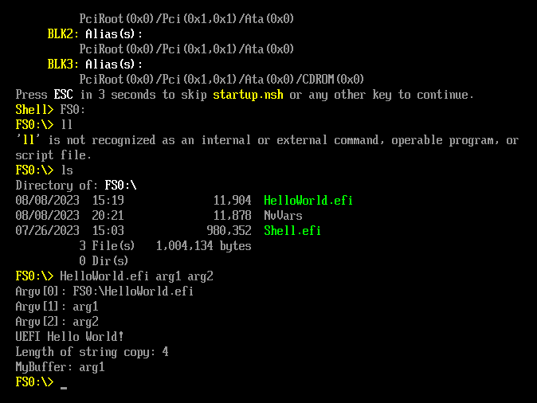
    <figcaption>Example of running the extended HelloWorld.efi application with multiple arguments from the UEFI shell.</figcaption>
</figure>

 Next, we can verify there is an issue when a large string of characters is given for the first argument. In the following screenshot, we run the application a few times with a varied length of 'A' characters for the first argument. When a large number of 'A' characters are input, the emulation freezes.

<figure>
    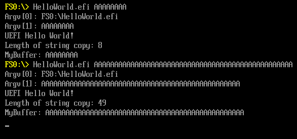
    <figcaption>Example of running the extended HelloWorld.efi application with multiple varying length of characters for the first argument in the UEFI shell.</figcaption>
</figure>

## TestHelloWorld: Creating a fuzzing test harnesses in HBFA

The [Host-based Firmware Analyzer User Guide](https://github.com/tianocore/edk2-staging/blob/HBFA/HBFA/Doc/User%20Guide%20-%20How-to-Add-New-Case.pdf) provides some recommendations for the files and folder structure used when creating a fuzzing test harness in HBFA. In this tutorial we will summarize and follow this approach.

### Where to create and save a fuzzing test case harness

It is recommended to create fuzzing test harness cases in the file structure provided in HBFA (although its not strictly required). Further, a minimal test case folder would consist of the test harness C-source code file (containing the fuzzing harness logic) and a module description file (the .inf file). The HBFA folder shown in the file structure (tree) relative to the repository root directory.

```
├── HBFA
    ├── UefiHostFuzzTestCasePkb
        ├── TestCase
            ├── ...                    # The directories here somewhat follow the 
                DeviceSecurityPkg      #  analogous directories from the EDK2 root
                FatPkg                 #  file structure (e.g. see MdeModulePkg)
                MdeModulePkg                     
                OvmfPkg
                SecurityPkg
                ...
                    └── TestModuleFolder   # This is the folder containing the new test case
                        └── TestXYZ.c      # Test harness/logic goes in this C-source code file
                        └── TestXYZ.inf    # The INF, module description file

```

A number of fuzzing test harness cases are included in HBFA. Carefully examining these tests harnesses is very helpful for learning how to implement fuzzing tests harnesses in HBFA. A listing of these files is presented in the following Table.

| Fuzzing Test Case Name | File Location (based from repository root) |
| ------------------------------------- | ----------------------------- |
| TestTpm2CommandLib | HBFA/UefiHostFuzzTestCasePkg/TestCase/SecurityPkg/Library/Tpm2CommandLib/TestTpm2CommandLib.{c,inf} |
| TestBmpSupportLib | HBFA/UefiHostFuzzTestCasePkg/TestCase/MdeModulePkg/Library/BaseBmpSupportLib/TestBmpSupportLib.{c,inf} |
| TestPartition | HBFA/UefiHostFuzzTestCasePkg/TestCase/MdeModulePkg/Universal/Disk/PartitionDxe/TestPartition.{c,inf} |
| TestUdf | HBFA/UefiHostFuzzTestCasePkg/TestCase/MdeModulePkg/Universal/Disk/UdfDxe/TestUdf.{c,inf} |
| TestUsb | HBFA/UefiHostFuzzTestCasePkg/TestCase/MdeModulePkg/Bus/Usb/UsbBusDxe/TestUsb.{c,inf} |
| TestPeiUsb | HBFA/UefiHostFuzzTestCasePkg/TestCase/MdeModulePkg/Bus/Usb/UsbBusPei/TestPeiUsb.{c,inf} |
| TestVariableSmm | HBFA/UefiHostFuzzTestCasePkg/TestCase/MdeModulePkg/Universal/Variable/RuntimeDxe/TestVariableSmm.{c,inf} |
| TestFmpAuthenticationLibPkcs7 | HBFA/UefiHostFuzzTestCasePkg/TestCase/SecurityPkg/Library/FmpAuthenticationLibPkcs7/TestFmpAuthenticationLibPkcs7.{c,inf} |
| TestFmpAuthenticationLibRsa2048Sha256 | HBFA/UefiHostFuzzTestCasePkg/TestCase/SecurityPkg/Library/FmpAuthenticationLibRsa2048Sha256/TestFmpAuthenticationLibRsa2048Sha256.{c,inf} |
| TestCapsulePei | HBFA/UefiHostFuzzTestCasePkg/TestCase/MdeModulePkg/Universal/CapsulePei/Common/TestCapsulePei.{c,inf} |
| TestFileName | HBFA/UefiHostFuzzTestCasePkg/TestCase/MdeModulePkg/Universal/Disk/UdfDxe/TestFileName.{c,inf} |
| TestPeiGpt | HBFA/UefiHostFuzzTestCasePkg/TestCase/FatPkg/FatPei/TestPeiGpt.{c,inf} |
| TestValidateTdxCfv | HBFA/UefiHostFuzzTestCasePkg/TestCase/OvmfPkg/EmuVariableFvbRuntimeDxe/TestValidateTdxCfv.{c,inf} |
| TestTcg2MeasureGptTable | HBFA/UefiHostFuzzTestCasePkg/TestCase/SecurityPkg/Library/DxeTpm2MeasureBootLib/TestTcg2MeasureGptTable.{c,inf} |
| TestTcg2MeasurePeImage | HBFA/UefiHostFuzzTestCasePkg/TestCase/SecurityPkg/Library/DxeTpm2MeasureBootLib/TestTcg2MeasurePeImage.{c,inf} |
| TestVirtioPciDevice | HBFA/UefiHostFuzzTestCasePkg/TestCase/OvmfPkg/VirtioPciDeviceDxe/TestVirtioPciDevice.{c,inf} |
| TestVirtio10Blk | HBFA/UefiHostFuzzTestCasePkg/TestCase/OvmfPkg/Virtio10BlkDxe/TestVirtio10Blk.{c,inf} |
| TestVirtioBlk | HBFA/UefiHostFuzzTestCasePkg/TestCase/OvmfPkg/VirtioBlkDxe/TestVirtioBlk.{c,inf} |
| TestVirtioBlkReadWrite | HBFA/UefiHostFuzzTestCasePkg/TestCase/OvmfPkg/VirtioBlkReadWrite/TestVirtioBlkReadWrite.{c,inf} |
| TestIdentifyAtaDevice | HBFA/UefiHostFuzzTestCasePkg/TestCase/MdeModulePkg/Bus/Ata/AhciPei/TestIdentifyAtaDevice.{c,inf} |

Additionally, many of the test-cases make use of stub-libraries to simulate responses from function call that would interact with hardware. These libraries are included in HBFA in the relative directory:

```
├── HBFA
    ├── UefiHostFuzzTestCasePkb
        ├── TestStub
            ├── DiskStubLib
            ├── Tcg2StubLib
            ├── Tpm2DeviceLibStub
            ├── ...
```

### Whats needed in the fuzzing harness files (.c and .inf)?

Behind the scenes, HBFA defines an EDK2 platform "ToolChainHarnessLib" (see: [source](../../../HBFA/UefiHostFuzzTestPkg/Library/ToolChainHarnessLib/ToolChainHarnessLib.inf)) that acts as the glue to interface (pass information) between the fuzzer (e.g. AFL, LibFuzzer, KLEE) and the functions and libraries one chooses to fuzz in the harness file. The specific implementations for this can been seen this [source](../../../HBFA/UefiHostFuzzTestPkg/Library/ToolChainHarnessLib/ToolChainHarnessLib.c). Likewise, the module description file will reference the "ToolChainHarnessLib" so that everything is included in the build.

#### The fuzzing harness test logic (C-source code file)

For the fuzzing harness C-source code file, a few important functions should be leveraged when creating a fuzzing harness to be used with AFL or LibFuzzer. These functions are ``FixBuffer()``, ``GetMaxBufferSize()``, and ``RunTestHarness()`` (shown in the following example skeleton code). The ``RunTestHarness()`` will contain the fuzzing test logic and a test buffer (``TestBuffer``) is used to handle the fuzz data passed between the fuzzer (e.g. AFL and LibFuzzer) and the test logic for each fuzzing instance. The code/logic in ``RunTestHarness()`` is ran on each pass (fuzz/input) of the external fuzzer. The functions  ``FixBuffer()`` and ``GetMaxBufferSize()`` are used when setting up/handling the test buffer. A skeleton structure for a fuzzing harness is presented in the [Host-based Firmware Analyzer User Guide](../archive/originalHBFA/Doc/User%20Guide%20-%20How-to-Add-New-Case.pdf) and is included in the following:

```c
/* The FixBuffer function is aimed to fix some bits in the TestBuffer so
that the TestBuffer can pass basic check and touch deeper paths. It’s
optional. */
VOID
FixBuffer (
UINT8 *TestBuffer
)
{ }

UINTN
EFIAPI
GetMaxBufferSize (
VOID
)
{
return TOTAL_SIZE;
}
VOID
EFIAPI
RunTestHarness(
IN VOID *TestBuffer,
IN UINTN TestBufferSize
)
{
FixBuffer(TestBuffer);
// test logic that use TestBuffer as an input to try to call tested
API.
TestLogicFunc(TestBuffer, TestBufferSize);
}
```

Here, the ``FixBuffer()`` is considered optional can be used to adjust and set initial value/bytes for the fuzzing buffer if one needs to ensure the buffer has certain bytes set. For example, overriding some bytes from the fuzzer (e.g. AFL, Libfuzzer) to ensure some check in the code being fuzzed is passed.

Follow this approach, we can examine an implementation in a fuzzing harness included with HBFA. [TestBmpSupportLib](../../../HBFA/UefiHostFuzzTestCasePkg/TestCase/MdeModulePkg/Library/BaseBmpSupportLib/TestBmpSupportLib.c) is a fuzzing test harness for the [BmpSupportLib](https://github.com/tianocore/edk2/blob/master/MdeModulePkg/Include/Library/BmpSupportLib.h) in EDK2, which is used to translate a BMP graphics image into a GOP buffer. The fuzzing harness is shown in the following:

```c
#include <Uefi.h>
#include <Protocol/BlockIo.h>
#include <Protocol/DiskIo.h>

#include <Library/BaseLib.h>
#include <Library/DebugLib.h>
#include <Library/BaseMemoryLib.h>
#include <Library/MemoryAllocationLib.h>
#include <PiDxe.h>
#include <Library/SafeIntLib.h>
#include <IndustryStandard/Bmp.h>
#include <Library/BmpSupportLib.h>

#define TOTAL_SIZE (1 * 1024)

VOID
FixBuffer (
  UINT8                   *TestBuffer
  )
{
}

UINTN
EFIAPI
GetMaxBufferSize (
  VOID
  )
{
  return TOTAL_SIZE;
}

VOID
EFIAPI
RunTestHarness(
  IN VOID  *TestBuffer,
  IN UINTN TestBufferSize
  )
{
  EFI_GRAPHICS_OUTPUT_BLT_PIXEL  *GopBlt;
  UINTN                          GopBltSize;
  UINTN                          PixelHeight;
  UINTN                          PixelWidth;
  FixBuffer (TestBuffer);
  GopBlt = NULL;
  TranslateBmpToGopBlt(
            TestBuffer,
            TestBufferSize,
            &GopBlt,
            &GopBltSize,
            &PixelHeight,
            &PixelWidth
            );
  if (GopBlt != NULL)
    FreePool (GopBlt);
}
```

Here, we can see that the functions ``FixBuffer()`` and ``GetMaxBufferSize()`` remain the same as presented in the skeleton fuzzing harness example. ``FixBuffer()`` is left untouched (not used) and ``GetMaxBufferSize()`` is used to simply return the buffer maximum size (defined with he macro for TOTAL_SIZE). The bulk of the action takes place in the ``RunTestHarness()`` function. In the fuzzing harness, the appropriate variables for calling the ``TranslateBmpToGopBlt()`` function from the EDK2 [BmpSupportLib](https://github.com/tianocore/edk2/blob/master/MdeModulePkg/Include/Library/BmpSupportLib.h) (see also [BmpSupportLib.c](https://github.com/tianocore/edk2/blob/master/MdeModulePkg/Library/BaseBmpSupportLib/BmpSupportLib.c)). ``TestBuffer``, a pointer to the buffer containing the fuzz data, is passed into the call to ``TranslateBmpToGopBlt`` the input BMP file to convert (i.e. the argument ``*BmpImage``). Last, at the end of the code block for ``RunTestHarness()`` it is essential to clean-up and free any resources that may have been allocated.

#### The module description file (INF file)

The module description file is described in detail in the EDK II documentation (e.g. see [Build Description Files](https://github.com/tianocore/tianocore.github.io/wiki/Build-Description-Files#the-inf-file) and [EDK II Module Information (INF) File Specification](https://tianocore-docs.github.io/edk2-InfSpecification/draft/#edk-ii-module-information-inf-file-specification)). This file is used to describe to the build system on how to build a module (e.g. a driver, library, or application). For an example, we'll look at the INF file for the [TestBmpSupportLib](../../../HBFA/UefiHostFuzzTestCasePkg/TestCase/MdeModulePkg/Library/BaseBmpSupportLib/TestBmpSupportLib.c) fuzzing test-case. The contents for this file ([TestBmpSupportLib.inf](../../../HBFA/UefiHostFuzzTestCasePkg/TestCase/MdeModulePkg/Library/BaseBmpSupportLib/TestBmpSupportLib.inf)) are shown in the following.

```ini
## @file
# Component description file for TestBmpSupportLib module.
#
# Copyright (c) 2018, Intel Corporation. All rights reserved.<BR>
# SPDX-License-Identifier: BSD-2-Clause-Patent
#
##

[Defines]
  INF_VERSION                    = 0x00010005
  BASE_NAME                      = TestBmpSupportLib
  FILE_GUID                      = E911AB26-4741-4621-93EF-305FEA98A851
  MODULE_TYPE                    = USER_DEFINED
  VERSION_STRING                 = 1.0

#
# The following information is for reference only and not required by the build tools.
#
#  VALID_ARCHITECTURES           = IA32 X64
#

[Sources]
  TestBmpSupportLib.c

[Packages]
  MdePkg/MdePkg.dec
  MdeModulePkg/MdeModulePkg.dec
  UefiHostTestPkg/UefiHostTestPkg.dec


[LibraryClasses]
  BaseLib
  BaseMemoryLib
  MemoryAllocationLib
  DebugLib
  SafeIntLib
  BmpSupportLib
  ToolChainHarnessLib
```

The sections in this INF file are: ``[Defines]``, ``[Sources]``, ``[Packages]``, and ``[LibraryClasses]``. A description for these sections is provided in the following Table. For additional information on these and a number of other sections that can be used, see the [documentation](https://github.com/tianocore/tianocore.github.io/wiki/Build-Description-Files#the-inf-file).

| Section              | Description                                                                                                                                                                                                                                                                                                                                                                                                                                                                                                                                                                                                                                                                                                                                                                                                                                                                       |
| -------------------- | --------------------------------------------------------------------------------------------------------------------------------------------------------------------------------------------------------------------------------------------------------------------------------------------------------------------------------------------------------------------------------------------------------------------------------------------------------------------------------------------------------------------------------------------------------------------------------------------------------------------------------------------------------------------------------------------------------------------------------------------------------------------------------------------------------------------------------------------------------------------------------- |
| ``[Defines]``        | This section should include the fields shown above in the INF file; however, there are a number of additional (optional) fields that can be defined that are listed in EDK2 documentation. Note for the present file, the ``FILE_GUID`` should be a unique GUID value; likewise, the value used for the ``BASE_NAME`` is used as a base part of the output name used in the for the final binary.                                                                                                                                                                                                                                                                                                                                                                                                                                                                                 |
| ``[Sources]``        | This section should list the various sources and header files used to build the module; in the case the source used for the fuzzing test harness is all in the file[TestBmpSupportLib.c](../../../HBFA/UefiHostFuzzTestCasePkg/TestCase/MdeModulePkg/Library/BaseBmpSupportLib/TestBmpSupportLib.c).                                                                                                                                                                                                                                                                                                                                                                                                                                                                                                                                      |
| ``[Packages]``       | This section should list the packages used by the module (the package description files, '.dec'). For this case, the files are[MdePkg/MdePkg.dec](https://github.com/tianocore/edk2/blob/master/MdePkg/MdePkg.dec), [MdeModulePkg/MdeModulePkg.dec](https://github.com/tianocore/edk2/blob/master/MdeModulePkg/MdeModulePkg.dec), and [UefiHostTestPkg/UefiHostTestPkg.dec](../../../HBFA/UefiHostTestPkg/UefiHostTestPkg.dec). The file ``MdeModulePkg/MdeModulePkg.dec`` should always be included as a package in this section for an EDK2 module. Further, ``MdeModulePkg/MdeModulePkg.dec`` is included because it is part of the dependencies for this specific test case (e.g. TestBmpSupportLib is a library and part of MdeModulePkg). Lastly, ``UefiHostTestPkg/UefiHostTestPkg.dec`` must be included for an HBFA fuzzing test case. |
| ``[LibraryClasses]`` | This section contains a list of the various libraries the module will use and should be linked with (or optionally required by a component), see:[EDK II Module Information (INF) File Specification](https://tianocore-docs.github.io/edk2-InfSpecification/release-1.27/2_inf_overview/212_[libraryclasses]_section.html#212-libraryclasses-section). Here, files included in the ``LibraryClasses`` section are those used included in the test harness ``TestBmpSupportLib.c``, from the Edk2 libraries. E.g. see the ``'#include <Library/BaseLib.h>, #include <Library/...>, ...'``. Additionally, for HBFA fuzzing test harnesses, ``ToolChainHarnessLib`` is required and included.                                                                                                                                                                                          |

If you jumped ahead to this section from [HelloWorld.inf: Examining the source](#helloworldinf-examining-the-source) use the link to go back.

## Developing a fuzzing harness for HelloWorldLib

First, we'll take a look at the files we will need to create or modify to develop our fuzzing harness. Here, our fuzzing effort will focus on developing a harness to fuzz the ``ProcessArgument()`` function from HelloWorldLib.

### Files that we will be modifying or creating when creating the fuzzing harness, TestHelloWorld

| Filename            | Description                                                                                                                                                                                                                                                              | File-Path (relative to hbfa-fl root)                                           |
| ------------------- | ------------------------------------------------------------------------------------------------------------------------------------------------------------------------------------------------------------------------------------------------------------------------ | --------------------------------------------------------------------------------------- |
| TestHelloWorld.c    | This is the C-source for for the fuzzing test harness. This is the focal point where the ``RunTestHarness()`` is written for the test case.                                                                                                                              | HBFA/UefiHostFuzzTestCasePkg/TestCase/MdeModulePkg/Application/HelloWorld/ |
| TestHelloWorld.inf  | The INF (build description file) for the TestHelloWorld fuzzing harness. This should reference any libraries needed to build the TestHelloWorld.c test harness.                                                                                                          | HBFA/UefiHostFuzzTestCasePkg/TestCase/MdeModulePkg/Application/HelloWorld/ |
| UefiHostTestPkg.dsc | This is the platform defined in HBFA that provides the fuzzing interface. When invoking the EDK2 build system, this should be included as the '-p' argument. A reference to the fuzzing test case INF file must be included under the '[Components]' field in this file. | HBFA/UefiHostTestPkg/                                                      |

### TestHelloWorld.c: Examining the source code

The source code for TestHelloWorld.c is included below. Several key code areas from TestHelloWorld.c are highlighted in the following figure:

<figure>
    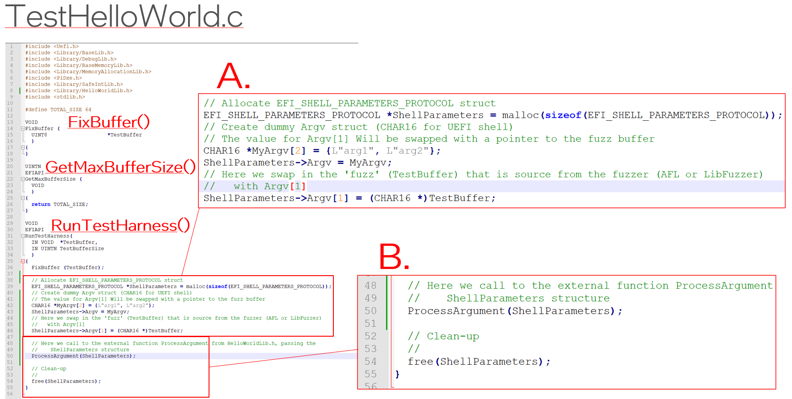
    <figcaption>Highlighted areas from source-code for TestHelloWorld.c.</figcaption>
</figure>

As described from the fuzzing test harness skeleton file, the key functions that are declared in a fuzzing harness for HBFA are:

1. FixBuffer()
2. GetMaxBufferSize() and
3. RunTestHarness()

Here, we'll focus on the test logic we are including in the ``RunTestHarness`` function.  First, as shown in the code block labeled with an A,  This block of code is all about creating a reference to a EFI_SHELL_PARAMETERS_PROTOCOL struct, which will be what we will pass to the ProcessArgument function from HelloWorldLib. We allocate such a struct on the heap and refer to with the name: ShellParameters. We then assign a reference to an Argv array to the appropriate element in the ShellParameters struct. Last, we swap out the reference for the first argument from a dummy string to that of our TestBuffer fuzz data. Therefore, when the call is made to ProcessArgument, it will handle the fuzz data as the first argument.

In the code block B, we make our call to ProcessArgument and call ``free`` to clear the memory out that we had allocated for out ShellParameters struct.  Note it is critical to clean up any allocations in the ``RunTestHarness`` function, otherwise you will introduce a memory leak which get called for every fuzz sent during you fuzzing session.

<details>
  <summary>Source-code for TestHelloWorld.c </summary>

```c
#include <Uefi.h>
#include <Library/BaseLib.h>
#include <Library/DebugLib.h>
#include <Library/BaseMemoryLib.h>
#include <Library/MemoryAllocationLib.h>
#include <PiDxe.h>
#include <Library/SafeIntLib.h>
#include <Library/HelloWorldLib.h>
#include <stdlib.h>

#define TOTAL_SIZE 64

VOID
FixBuffer (
  UINT8                   *TestBuffer
  )
{
}

UINTN
EFIAPI
GetMaxBufferSize (
  VOID
  )
{
  return TOTAL_SIZE;
}

VOID
EFIAPI
RunTestHarness(
  IN VOID  *TestBuffer,
  IN UINTN TestBufferSize
  )
{
  FixBuffer (TestBuffer);

  // Allocate EFI_SHELL_PARAMETERS_PROTOCOL struct 
  EFI_SHELL_PARAMETERS_PROTOCOL *ShellParameters = malloc(sizeof(EFI_SHELL_PARAMETERS_PROTOCOL));
  // Create dummy Argv struct (CHAR16 for UEFI shell)
  // The value for Argv[1] Will be swapped with a pointer to the fuzz buffer
  CHAR16 *MyArgv[2] = {L"arg1", L"arg2"};
  ShellParameters->Argv = MyArgv;
  // Here we swap in the 'fuzz' (TestBuffer) that is source from the fuzzer (AFL or LibFuzzer)
  //   with Argv[1]
  ShellParameters->Argv[1] = (CHAR16 *)TestBuffer;
  
  // Here we call to the external function ProcessArgument from HelloWorldLib.h, passing the 
  //    ShellParameters structure
  ProcessArgument(ShellParameters);
  
  // Clean-up
  //
  free(ShellParameters);
}

```

</details>

### TestHelloWorld.inf: Examining the source code

The source code for TestHelloWorld.inf is included below. The TestHelloWorld.inf build description follows the same rules as for any other module that one would develop in EDK II. However, we note one must include the following items in their ``[Packages]`` and ``[LibraryClasses]`` sections as these are part of the platform (UefiHostTestPkg) and libraries used from HBFA to enable fuzzing.

1. In the ``[Packages]`` section, there should be an entry for ``UefiHostTestPkg/UefiHostTestPkg.dec``
2. In the ``[LibraryClasses]`` section, there should be an entry for ``ToolChainHarnessLib``

<details>
  <summary>Source-code for TestHelloWorld.inf </summary>

```ini
## @file
# Component description file for TestHelloWorld module.
#

[Defines]
  INF_VERSION                    = 0x00010005
  BASE_NAME                      = TestHelloWorld
  FILE_GUID                      = cc009d97-035c-430f-ac0d-c0e7451f1a12
  MODULE_TYPE                    = USER_DEFINED
  VERSION_STRING                 = 1.0

# USER_DEFINED
#
# The following information is for reference only and not required by the build tools.
#
#  VALID_ARCHITECTURES           = IA32 X64
#

[Sources]
  TestHelloWorld.c

[Packages]
  MdePkg/MdePkg.dec
  MdeModulePkg/MdeModulePkg.dec
  UefiHostTestPkg/UefiHostTestPkg.dec

[LibraryClasses]
  BaseLib
  BaseMemoryLib
  MemoryAllocationLib
  DebugLib
  ToolChainHarnessLib
  UefiApplicationEntryPoint
  UefiLib
  PcdLib
  UefiBootServicesTableLib
  HelloWorldLib

```

</details>

### UefiHostTestPkg.dsc: Examining the source code

The source code for UefiHostTestPkg.dsc is included below. Further, the relevant additions are shown in the following Figure.

<figure>
    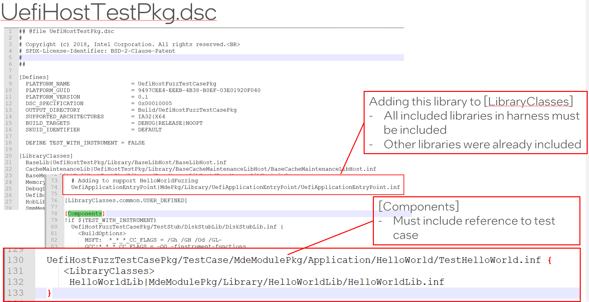
    <figcaption>Example of references added for the TestHelloWorld fuzzing test case to UefiHostTestPkg.dsc.</figcaption>
</figure>

Importantly, for a fuzzing test harness in HBFA, you must ensure that there is a reference for it in the ``[Components]`` section of the UefiHostTestPkg description file. An entry for the TestHelloWorld fuzzing module can be seen in red box at the bottom of the Figure. This entry also includes a reference in the ``<LibraryClasses>`` field to the HelloWorldLib build description file.

<details>
  <summary>Source-code for UefiHostTestPkg.dsc </summary>

```ini
## @file UefiHostTestPkg.dsc
# 
# Copyright (c) 2018, Intel Corporation. All rights reserved.<BR>
# SPDX-License-Identifier: BSD-2-Clause-Patent
#
##

[Defines]
  PLATFORM_NAME                  = UefiHostFuzzTestCasePkg
  PLATFORM_GUID                  = 9497CEE4-EEEB-4B38-B0EF-03E01920F040
  PLATFORM_VERSION               = 0.1
  DSC_SPECIFICATION              = 0x00010005
  OUTPUT_DIRECTORY               = Build/UefiHostFuzzTestCasePkg
  SUPPORTED_ARCHITECTURES        = IA32|X64
  BUILD_TARGETS                  = DEBUG|RELEASE|NOOPT
  SKUID_IDENTIFIER               = DEFAULT

  DEFINE TEST_WITH_INSTRUMENT = FALSE

[LibraryClasses]
  BaseLib|UefiHostTestPkg/Library/BaseLibHost/BaseLibHost.inf
  CacheMaintenanceLib|UefiHostTestPkg/Library/BaseCacheMaintenanceLibHost/BaseCacheMaintenanceLibHost.inf
  BaseMemoryLib|UefiHostTestPkg/Library/BaseMemoryLibHost/BaseMemoryLibHost.inf
  MemoryAllocationLib|UefiHostTestPkg/Library/MemoryAllocationLibHost/MemoryAllocationLibHost.inf
  DebugLib|UefiHostTestPkg/Library/DebugLibHost/DebugLibHost.inf
  UefiBootServicesTableLib|UefiHostTestPkg/Library/UefiBootServicesTableLibHost/UefiBootServicesTableLibHost.inf
  HobLib|UefiHostTestPkg/Library/HobLibHost/HobLibHost.inf
  SmmMemLib|UefiHostTestPkg/Library/SmmMemLibHost/SmmMemLibHost.inf
  SmmMemLibStubLib|UefiHostTestPkg/Library/SmmMemLibHost/SmmMemLibHost.inf
  DevicePathLib|UefiHostTestPkg/Library/UefiDevicePathLibHost/UefiDevicePathLibHost.inf
  DxeServicesTableLib|UefiHostTestPkg/Library/DxeServicesTableLibHost/DxeServicesTableLibHost.inf
  UefiRuntimeServicesTableLib|MdePkg/Library/UefiRuntimeServicesTableLib/UefiRuntimeServicesTableLib.inf
  SmmServicesTableLib|UefiHostTestPkg/Library/SmmServicesTableLibHost/SmmServicesTableLibHost.inf
  MmServicesTableLib|UefiHostTestPkg/Library/SmmServicesTableLibHost/SmmServicesTableLibHost.inf
  PeiServicesLib|MdePkg/Library/PeiServicesLib/PeiServicesLib.inf
  PeiServicesTablePointerLib|UefiHostTestPkg/Library/PeiServicesTablePointerLibHost/PeiServicesTablePointerLibHost.inf
  UefiDriverEntryPoint|UefiHostTestPkg/Library/UefiDriverEntryPointHost/UefiDriverEntryPointHost.inf
  PeimEntryPoint|UefiHostTestPkg/Library/PeimEntryPointHost/PeimEntryPointHost.inf
  ToolChainHarnessLib|UefiHostFuzzTestPkg/Library/ToolChainHarnessLib/ToolChainHarnessLib.inf

  PcdLib|MdePkg/Library/BasePcdLibNull/BasePcdLibNull.inf
  PerformanceLib|MdePkg/Library/BasePerformanceLibNull/BasePerformanceLibNull.inf
  ReportStatusCodeLib|MdePkg/Library/BaseReportStatusCodeLibNull/BaseReportStatusCodeLibNull.inf
  SerialPortLib|MdePkg/Library/BaseSerialPortLibNull/BaseSerialPortLibNull.inf
  SafeIntLib|MdePkg/Library/BaseSafeIntLib/BaseSafeIntLib.inf
  PeCoffGetEntryPointLib|MdePkg/Library/BasePeCoffGetEntryPointLib/BasePeCoffGetEntryPointLib.inf
  DebugAgentLib|MdeModulePkg/Library/DebugAgentLibNull/DebugAgentLibNull.inf
  TimerLib|UefiHostTestPkg/Library/BaseTimerLibHost/BaseTimerLibHost.inf

  UefiLib|MdePkg/Library/UefiLib/UefiLib.inf
  PrintLib|MdePkg/Library/BasePrintLib/BasePrintLib.inf

  SynchronizationLib|MdePkg/Library/BaseSynchronizationLib/BaseSynchronizationLib.inf

  DiskStubLib|UefiHostFuzzTestCasePkg/TestStub/DiskStubLib/DiskStubLib.inf
  Usb2HcStubLib|UefiHostFuzzTestCasePkg/TestStub/Usb2HcStubLib/Usb2HcStubLib.inf
  Usb2HcPpiStubLib|UefiHostFuzzTestCasePkg/TestStub/Usb2HcPpiStubLib/Usb2HcPpiStubLib.inf
  UsbIoPpiStubLib|UefiHostFuzzTestCasePkg/TestStub/UsbIoPpiStubLib/UsbIoPpiStubLib.inf
  Tcg2StubLib|UefiHostFuzzTestCasePkg/TestStub/Tcg2StubLib/Tcg2StubLib.inf
  # Add below libs due to Edk2 update
  VariablePolicyLib|MdeModulePkg/Library/VariablePolicyLib/VariablePolicyLib.inf
  VariablePolicyHelperLib|MdeModulePkg/Library/VariablePolicyHelperLib/VariablePolicyHelperLib.inf
!if $(TEST_WITH_INSTRUMENT)
  IniParsingLib|UefiInstrumentTestPkg/Library/IniParsingLib/IniParsingLib.inf
  NULL|UefiInstrumentTestPkg/Library/InstrumentLib/InstrumentLib.inf
  InstrumentHookLib|UefiInstrumentTestPkg/Library/InstrumentHookLibNull/InstrumentHookLibNull.inf
!endif

!if $(TEST_WITH_KLEE)
  BaseLib|UefiHostTestPkg/Library/BaseLibHost/BaseLibHostNoAsm.inf
!endif

  # Adding to support HelloWorldFuzzing
  UefiApplicationEntryPoint|MdePkg/Library/UefiApplicationEntryPoint/UefiApplicationEntryPoint.inf   

[LibraryClasses.common.USER_DEFINED]

[Components]
!if $(TEST_WITH_INSTRUMENT)
  UefiHostFuzzTestCasePkg/TestStub/DiskStubLib/DiskStubLib.inf {
    <BuildOptions>
      MSFT:  *_*_*_CC_FLAGS = /Gh /GH /Od /GL-
      GCC:*_*_*_CC_FLAGS = -O0 -finstrument-functions
  }
  UefiHostTestPkg/Library/MemoryAllocationLibHost/MemoryAllocationLibHost.inf {
    <BuildOptions>
      MSFT:  *_*_*_CC_FLAGS = /Gh /GH /Od /GL-
      GCC:*_*_*_CC_FLAGS = -O0 -finstrument-functions
  }
  UefiHostFuzzTestPkg/Library/ToolChainHarnessLib/ToolChainHarnessLib.inf {
    <BuildOptions>
      MSFT:  *_*_*_CC_FLAGS = "-DTEST_WITH_INSTRUMENT=TRUE"
      GCC:*_*_*_CC_FLAGS = "-DTEST_WITH_INSTRUMENT=TRUE"
  }
!endif

  UefiHostFuzzTestCasePkg/TestCase/MdeModulePkg/Universal/Disk/PartitionDxe/TestPartition.inf {
    <LibraryClasses>
      NULL|MdeModulePkg/Universal/Disk/PartitionDxe/PartitionDxe.inf
!if $(TEST_WITH_INSTRUMENT)
    <BuildOptions>
      MSFT:  *_*_*_CC_FLAGS = "-DTEST_WITH_INSTRUMENT=TRUE"
      GCC:*_*_*_CC_FLAGS = "-DTEST_WITH_INSTRUMENT=TRUE"
    <LibraryClasses>
      InstrumentHookLib|UefiHostFuzzTestCasePkg/TestCase/MdeModulePkg/Universal/Disk/PartitionDxe/InstrumentHookLibTestPartition/InstrumentHookLibTestPartition.inf
!endif
  }

  UefiHostFuzzTestCasePkg/TestCase/MdeModulePkg/Universal/Disk/UdfDxe/TestUdf.inf {
    <LibraryClasses>
      NULL|MdeModulePkg/Universal/Disk/UdfDxe/UdfDxe.inf
!if $(TEST_WITH_INSTRUMENT)
    <BuildOptions>
      MSFT:  *_*_*_CC_FLAGS = "-DTEST_WITH_INSTRUMENT=TRUE"
      GCC:*_*_*_CC_FLAGS = "-DTEST_WITH_INSTRUMENT=TRUE"
    <LibraryClasses>
      InstrumentHookLib|UefiHostFuzzTestCasePkg/TestCase/MdeModulePkg/Universal/Disk/UdfDxe/InstrumentHookLibTestUdf/InstrumentHookLibTestUdf.inf
!endif
  }
  UefiHostFuzzTestCasePkg/TestCase/MdeModulePkg/Universal/Disk/UdfDxe/TestFileName.inf {
    <LibraryClasses>
      NULL|MdeModulePkg/Universal/Disk/UdfDxe/UdfDxe.inf
  }

  UefiHostFuzzTestCasePkg/TestCase/MdeModulePkg/Library/BaseBmpSupportLib/TestBmpSupportLib.inf {
    <LibraryClasses>
      BmpSupportLib|MdeModulePkg/Library/BaseBmpSupportLib/BaseBmpSupportLib.inf
  }

  UefiHostFuzzTestCasePkg/TestCase/MdeModulePkg/Application/HelloWorld/TestHelloWorld.inf {
     <LibraryClasses> 
      HelloWorldLib|MdeModulePkg/Library/HelloWorldLib/HelloWorldLib.inf
  }

  UefiHostFuzzTestCasePkg/TestCase/MdeModulePkg/Library/DxeCapsuleLibFmp/TestDxeCapsuleLibFmp.inf {
    <LibraryClasses>
    NULL|MdeModulePkg/Library/DxeCapsuleLibFmp/DxeCapsuleLib.inf
    FileHandleLib|MdePkg/Library/UefiFileHandleLib/UefiFileHandleLib.inf
    UefiHiiServicesLib|MdeModulePkg/Library/UefiHiiServicesLib/UefiHiiServicesLib.inf
    SortLib|MdeModulePkg/Library/BaseSortLib/BaseSortLib.inf
    HiiLib|MdeModulePkg/Library/UefiHiiLib/UefiHiiLib.inf
    DxeServicesLib|MdePkg/Library/DxeServicesLib/DxeServicesLib.inf
    UefiBootManagerLib|MdeModulePkg/Library/UefiBootManagerLib/UefiBootManagerLib.inf
    BmpSupportLib|MdeModulePkg/Library/BaseBmpSupportLib/BaseBmpSupportLib.inf
    DisplayUpdateProgressLib|MdeModulePkg/Library/DisplayUpdateProgressLibGraphics/DisplayUpdateProgressLibGraphics.inf
  }
  UefiHostFuzzTestCasePkg/TestCase/MdeModulePkg/Universal/CapsulePei/Common/TestCapsulePei.inf {
    <LibraryClasses>
    NULL|MdeModulePkg/Universal/CapsulePei/CapsulePei.inf
  }

  UefiHostFuzzTestCasePkg/TestCase/MdeModulePkg/Universal/Variable/RuntimeDxe/TestVariableSmm.inf {
    <LibraryClasses>
    NULL|MdeModulePkg/Universal/Variable/RuntimeDxe/VariableSmm.inf
    NULL|UefiHostTestPkg/Library/BaseLibNullCpuid/BaseLibNullCpuid.inf
    AuthVariableLib|MdeModulePkg/Library/AuthVariableLibNull/AuthVariableLibNull.inf
    VarCheckLib|UefiHostTestPkg/Library/VarCheckLibNull/VarCheckLibNull.inf
    VariableFlashInfoLib|MdeModulePkg/Library/BaseVariableFlashInfoLib/BaseVariableFlashInfoLib.inf
  }

  UefiHostFuzzTestCasePkg/TestCase/SecurityPkg/Library/Tpm2CommandLib/TestTpm2CommandLib.inf {
    <LibraryClasses>
      Tpm2CommandLib|SecurityPkg/Library/Tpm2CommandLib/Tpm2CommandLib.inf
      Tpm2DeviceLib|UefiHostFuzzTestCasePkg/TestStub/Tpm2DeviceLibStub/Tpm2DeviceLibStub.inf
      Tpm2DeviceStubLib|UefiHostFuzzTestCasePkg/TestStub/Tpm2DeviceLibStub/Tpm2DeviceLibStub.inf
  }

  UefiHostFuzzTestCasePkg/TestCase/MdeModulePkg/Bus/Usb/UsbBusDxe/TestUsb.inf {
    <LibraryClasses>
    NULL|MdeModulePkg/Bus/Usb/UsbBusDxe/UsbBusDxe.inf
  }
  UefiHostFuzzTestCasePkg/TestCase/MdeModulePkg/Bus/Usb/UsbBusPei/TestPeiUsb.inf {
    <LibraryClasses>
    NULL|MdeModulePkg/Bus/Usb/UsbBusPei/UsbBusPei.inf
  }

  UefiHostFuzzTestCasePkg/TestCase/SecurityPkg/Library/FmpAuthenticationLibPkcs7/TestFmpAuthenticationLibPkcs7.inf {
    <LibraryClasses>
    FmpAuthenticationLib|SecurityPkg/Library/FmpAuthenticationLibPkcs7/FmpAuthenticationLibPkcs7.inf
    BaseCryptLib|UefiHostFuzzTestCasePkg/TestCase/SecurityPkg/Library/FmpAuthenticationLibPkcs7/CryptoLibStubPkcs7.inf
  }
  UefiHostFuzzTestCasePkg/TestCase/SecurityPkg/Library/FmpAuthenticationLibRsa2048Sha256/TestFmpAuthenticationLibRsa2048Sha256.inf {
    <LibraryClasses>
    FmpAuthenticationLib|SecurityPkg/Library/FmpAuthenticationLibRsa2048Sha256/FmpAuthenticationLibRsa2048Sha256.inf
    BaseCryptLib|UefiHostFuzzTestCasePkg/TestCase/SecurityPkg/Library/FmpAuthenticationLibRsa2048Sha256/CryptoLibStubRsa2048Sha256.inf
  }

  UefiHostFuzzTestCasePkg/TestCase/FatPkg/FatPei/TestPeiGpt.inf {
    <LibraryClasses>
      NULL|UefiHostFuzzTestCasePkg/TestCase/FatPkg/FatPei/Override/FatPei.inf
!if $(TEST_WITH_INSTRUMENT)
    <BuildOptions>
      MSFT:  *_*_*_CC_FLAGS = "-DTEST_WITH_INSTRUMENT=TRUE"
      GCC:*_*_*_CC_FLAGS = "-DTEST_WITH_INSTRUMENT=TRUE"
    <LibraryClasses>
      InstrumentHookLib|UefiHostFuzzTestCasePkg/TestCase/FatPkg/FatPei/InstrumentHookLibTestPeiGpt/InstrumentHookLibTestPeiGpt.inf
!endif
  }

  UefiHostFuzzTestCasePkg/TestCase/MdeModulePkg/Library/SmmLockBoxLib/UpdateLockBoxTestCase/TestUpdateLockBoxFuzzLength.inf {
  <LibraryClasses>
    NULL|MdeModulePkg/Library/SmmLockBoxLib/SmmLockBoxSmmLib.inf
  }
  UefiHostFuzzTestCasePkg/TestCase/MdeModulePkg/Library/SmmLockBoxLib/UpdateLockBoxTestCase/TestUpdateLockBoxFuzzOffset.inf {
  <LibraryClasses>
    NULL|MdeModulePkg/Library/SmmLockBoxLib/SmmLockBoxSmmLib.inf
  }
  UefiHostFuzzTestCasePkg/TestCase/MdeModulePkg/Bus/Ata/AhciPei/TestIdentifyAtaDevice.inf{
  <LibraryClasses>
      NULL|UefiHostFuzzTestCasePkg/TestCase/MdeModulePkg/Bus/Ata/AhciPei/Override/AhciPei.inf
      IoLib|MdePkg/Library/BaseIoLibIntrinsic/BaseIoLibIntrinsic.inf
      PeiServicesLib|MdePkg/Library/PeiServicesLib/PeiServicesLib.inf
      LockBoxLib|MdeModulePkg/Library/LockBoxNullLib/LockBoxNullLib.inf
      PeiServicesTablePointerLib|MdePkg/Library/PeiServicesTablePointerLib/PeiServicesTablePointerLib.inf
      TdxLib|MdePkg/Library/TdxLib/TdxLib.inf 
     CcProbeLib|OvmfPkg/Library/CcProbeLib/DxeCcProbeLib.inf
	    RegisterFilterLib|MdePkg/Library/RegisterFilterLibNull/RegisterFilterLibNull.inf 
  }

  UefiHostFuzzTestCasePkg/TestCase/OvmfPkg/Library/TdxStartupLib/TestHobList.inf {
  <LibraryClasses>
   LocalApicLib|UefiCpuPkg/Library/BaseXApicX2ApicLib/BaseXApicX2ApicLib.inf
   QemuFwCfgSimpleParserLib|OvmfPkg/Library/QemuFwCfgSimpleParserLib/QemuFwCfgSimpleParserLib.inf
   MtrrLib|UefiCpuPkg/Library/MtrrLib/MtrrLib.inf
   PeiHardwareInfoLib|OvmfPkg/Library/HardwareInfoLib/PeiHardwareInfoLib.inf
   PrePiHobListPointerLib|OvmfPkg/IntelTdx/PrePiHobListPointerLibTdx/PrePiHobListPointerLibTdx.inf
   PlatformInitLib|OvmfPkg/Library/PlatformInitLib/PlatformInitLib.inf
   PeilessStartupLib|OvmfPkg/Library/PeilessStartupLib/PeilessStartupLib.inf
   RegisterFilterLib|MdePkg/Library/RegisterFilterLibNull/RegisterFilterLibNull.inf
   #UefiCpuLib|UefiCpuPkg/Library/BaseUefiCpuLib/BaseUefiCpuLib.inf
   IoLib|MdePkg/Library/BaseIoLibIntrinsic/BaseIoLibIntrinsicSev.inf
   #LocalApicLib|UefiCpuPkg/Library/BaseXApicX2ApicLib/BaseXApicX2ApicLibSec.inf
   CpuExceptionHandlerLib|UefiCpuPkg/Library/CpuExceptionHandlerLib/DxeCpuExceptionHandlerLib.inf
   TdxLib|MdePkg/Library/TdxLib/TdxLib.inf
   PrePiLib|EmbeddedPkg/Library/PrePiLib/PrePiLib.inf
   HashLib|SecurityPkg/Library/HashLibTdx/HashLibTdx.inf 
   UefiDecompressLib|MdePkg/Library/BaseUefiDecompressLib/BaseUefiDecompressLib.inf
   PeCoffLib|MdePkg/Library/BasePeCoffLib/BasePeCoffLib.inf
   ExtractGuidedSectionLib|MdePkg/Library/BaseExtractGuidedSectionLib/BaseExtractGuidedSectionLib.inf
   PeCoffExtraActionLib|SourceLevelDebugPkg/Library/PeCoffExtraActionLibDebug/PeCoffExtraActionLibDebug.inf
   PciLib|MdePkg/Library/BasePciLibCf8/BasePciLibCf8.inf
   QemuFwCfgLib|OvmfPkg/Library/QemuFwCfgLib/QemuFwCfgDxeLib.inf
   MemEncryptTdxLib|OvmfPkg/Library/BaseMemEncryptTdxLib/BaseMemEncryptTdxLib.inf
   MemEncryptSevLib|OvmfPkg/Library/BaseMemEncryptSevLib/DxeMemEncryptSevLib.inf
   CpuLib|MdePkg/Library/BaseCpuLib/BaseCpuLib.inf
   PciCf8Lib|MdePkg/Library/BasePciCf8Lib/BasePciCf8Lib.inf
   CcExitLib|OvmfPkg/Library/CcExitLib/CcExitLib.inf
   BaseCryptLib|CryptoPkg/Library/BaseCryptLib/BaseCryptLib.inf
   CcExitLib|OvmfPkg/Library/CcExitLib/CcExitLib.inf
   CcProbeLib|OvmfPkg/Library/CcProbeLib/DxeCcProbeLib.inf
   TdxMailboxLib|OvmfPkg/Library/TdxMailboxLib/TdxMailboxLib.inf
   TpmMeasurementLib|SecurityPkg/Library/DxeTpmMeasurementLib/DxeTpmMeasurementLib.inf
   HobLib|EmbeddedPkg/Library/PrePiHobLib/PrePiHobLib.inf
   BaseLib|MdePkg/Library/BaseLib/BaseLib.inf
  } 
    UefiHostFuzzTestCasePkg/TestCase/SecurityPkg/Library/DxeTpm2MeasureBootLib/TestTcg2MeasureGptTable.inf{
  <LibraryClasses>
   NULL|SecurityPkg/Library/DxeTpm2MeasureBootLib/DxeTpm2MeasureBootLib.inf
   BaseCryptLib|UefiHostFuzzTestCasePkg/TestCase/SecurityPkg/Library/FmpAuthenticationLibPkcs7/CryptoLibStubPkcs7.inf
   PeCoffLib|MdePkg/Library/BasePeCoffLib/BasePeCoffLib.inf
   SecurityManagementLib|MdeModulePkg/Library/DxeSecurityManagementLib/DxeSecurityManagementLib.inf
   DxeServicesLib|MdePkg/Library/DxeServicesLib/DxeServicesLib.inf
   PeCoffExtraActionLib|MdePkg/Library/BasePeCoffExtraActionLibNull/BasePeCoffExtraActionLibNull.inf
   OpensslLib|CryptoPkg/Library/OpensslLib/OpensslLib.inf
   IntrinsicLib|CryptoPkg/Library/IntrinsicLib/IntrinsicLib.inf
   RngLib|MdePkg/Library/BaseRngLibTimerLib/BaseRngLibTimerLib.inf
   CcProbeLib|OvmfPkg/Library/CcProbeLib/DxeCcProbeLib.inf
  }
 
  UefiHostFuzzTestCasePkg/TestCase/SecurityPkg/Library/DxeTpm2MeasureBootLib/TestTcg2MeasurePeImage.inf{
  <LibraryClasses>
   NULL|SecurityPkg/Library/DxeTpm2MeasureBootLib/DxeTpm2MeasureBootLib.inf
   BaseCryptLib|UefiHostFuzzTestCasePkg/TestCase/SecurityPkg/Library/FmpAuthenticationLibPkcs7/CryptoLibStubPkcs7.inf
   PeCoffLib|MdePkg/Library/BasePeCoffLib/BasePeCoffLib.inf
   SecurityManagementLib|MdeModulePkg/Library/DxeSecurityManagementLib/DxeSecurityManagementLib.inf
   DxeServicesLib|MdePkg/Library/DxeServicesLib/DxeServicesLib.inf
   PeCoffExtraActionLib|MdePkg/Library/BasePeCoffExtraActionLibNull/BasePeCoffExtraActionLibNull.inf
   OpensslLib|CryptoPkg/Library/OpensslLib/OpensslLib.inf
   IntrinsicLib|CryptoPkg/Library/IntrinsicLib/IntrinsicLib.inf
   RngLib|MdePkg/Library/BaseRngLibTimerLib/BaseRngLibTimerLib.inf
   CcProbeLib|OvmfPkg/Library/CcProbeLib/DxeCcProbeLib.inf
  }
 UefiHostFuzzTestCasePkg/TestCase/OvmfPkg/EmuVariableFvbRuntimeDxe/TestValidateTdxCfv.inf{
  <LibraryClasses>
   NULL|OvmfPkg/EmuVariableFvbRuntimeDxe/Fvb.inf
   UefiRuntimeLib|MdePkg/Library/UefiRuntimeLib/UefiRuntimeLib.inf
   PlatformFvbLib|OvmfPkg/Library/EmuVariableFvbLib/EmuVariableFvbLib.inf
   CcProbeLib|OvmfPkg/Library/CcProbeLib/DxeCcProbeLib.inf
   PcdLib|MdePkg/Library/DxePcdLib/DxePcdLib.inf
   BaseLib|MdePkg/Library/BaseLib/BaseLib.inf
   PeiHardwareInfoLib|OvmfPkg/Library/HardwareInfoLib/PeiHardwareInfoLib.inf
   RegisterFilterLib|MdePkg/Library/RegisterFilterLibNull/RegisterFilterLibNull.inf
   #UefiCpuLib|UefiCpuPkg/Library/BaseUefiCpuLib/BaseUefiCpuLib.inf
   LocalApicLib|UefiCpuPkg/Library/BaseXApicX2ApicLib/BaseXApicX2ApicLib.inf
   CcExitLib|OvmfPkg/Library/CcExitLib/CcExitLib.inf
   MemEncryptTdxLib|OvmfPkg/Library/BaseMemEncryptTdxLib/BaseMemEncryptTdxLib.inf
   MemEncryptSevLib|OvmfPkg/Library/BaseMemEncryptSevLib/DxeMemEncryptSevLib.inf
   CpuLib|MdePkg/Library/BaseCpuLib/BaseCpuLib.inf
   PciExpressLib|MdePkg/Library/BasePciExpressLib/BasePciExpressLib.inf  
   PciCf8Lib|MdePkg/Library/BasePciCf8Lib/BasePciCf8Lib.inf
   TdxLib|MdePkg/Library/TdxLib/TdxLib.inf
   PciLib|OvmfPkg/Library/DxePciLibI440FxQ35/DxePciLibI440FxQ35.inf
   MtrrLib|UefiCpuPkg/Library/MtrrLib/MtrrLib.inf
   QemuFwCfgSimpleParserLib|OvmfPkg/Library/QemuFwCfgSimpleParserLib/QemuFwCfgSimpleParserLib.inf
   QemuFwCfgLib|OvmfPkg/Library/QemuFwCfgLib/QemuFwCfgDxeLib.inf
   IoLib|MdePkg/Library/BaseIoLibIntrinsic/BaseIoLibIntrinsicSev.inf
   PlatformInitLib|OvmfPkg/Library/PlatformInitLib/PlatformInitLib.inf
  }

 UefiHostFuzzTestCasePkg/TestCase/OvmfPkg/VirtioPciDeviceDxe/TestVirtioPciDevice.inf{
  <LibraryClasses>
   UefiPciCapPciIoLib|OvmfPkg/Library/UefiPciCapPciIoLib/UefiPciCapPciIoLib.inf
   BasePciCapLib|OvmfPkg/Library/BasePciCapLib/BasePciCapLib.inf
   VirtioPciDevice10StubLib|UefiHostFuzzTestCasePkg/TestStub/VirtioPciDevice10StubLib/VirtioPciDevice10StubLib.inf
   VirtioLib|OvmfPkg/Library/VirtioLib/VirtioLib.inf
   UefiRuntimeLib|MdePkg/Library/UefiRuntimeLib/UefiRuntimeLib.inf
   OrderedCollectionLib|MdePkg/Library/BaseOrderedCollectionRedBlackTreeLib/BaseOrderedCollectionRedBlackTreeLib.inf
  }

 UefiHostFuzzTestCasePkg/TestCase/OvmfPkg/Virtio10BlkDxe/TestVirtio10Blk.inf{
  <LibraryClasses>
   NULL|OvmfPkg/VirtioBlkDxe/VirtioBlk.inf
   UefiPciCapPciIoLib|OvmfPkg/Library/UefiPciCapPciIoLib/UefiPciCapPciIoLib.inf
   BasePciCapLib|OvmfPkg/Library/BasePciCapLib/BasePciCapLib.inf
   VirtioBlkStubLib|UefiHostFuzzTestCasePkg/TestStub/VirtioBlkStubLib/VirtioBlkStubLib.inf
   VirtioPciDevice10StubLib|UefiHostFuzzTestCasePkg/TestStub/VirtioPciDevice10StubLib/VirtioPciDevice10StubLib.inf
   VirtioLib|OvmfPkg/Library/VirtioLib/VirtioLib.inf
   UefiRuntimeLib|MdePkg/Library/UefiRuntimeLib/UefiRuntimeLib.inf
   OrderedCollectionLib|MdePkg/Library/BaseOrderedCollectionRedBlackTreeLib/BaseOrderedCollectionRedBlackTreeLib.inf
  }

 UefiHostFuzzTestCasePkg/TestCase/OvmfPkg/VirtioBlkDxe/TestVirtioBlk.inf{
  <LibraryClasses>
   NULL|OvmfPkg/VirtioBlkDxe/VirtioBlk.inf
   NULL|OvmfPkg/VirtioPciDeviceDxe/VirtioPciDeviceDxe.inf
   VirtioBlkStubLib|UefiHostFuzzTestCasePkg/TestStub/VirtioBlkStubLib/VirtioBlkStubLib.inf
   VirtioPciDevice10StubLib|UefiHostFuzzTestCasePkg/TestStub/VirtioPciDeviceStubLib/VirtioPciDeviceStubLib.inf
   VirtioLib|OvmfPkg/Library/VirtioLib/VirtioLib.inf
   UefiRuntimeLib|MdePkg/Library/UefiRuntimeLib/UefiRuntimeLib.inf
   OrderedCollectionLib|MdePkg/Library/BaseOrderedCollectionRedBlackTreeLib/BaseOrderedCollectionRedBlackTreeLib.inf
  }

 UefiHostFuzzTestCasePkg/TestCase/OvmfPkg/VirtioBlkReadWrite/TestVirtioBlkReadWrite.inf{
  <LibraryClasses>
   NULL|OvmfPkg/VirtioBlkDxe/VirtioBlk.inf
   NULL|OvmfPkg/VirtioPciDeviceDxe/VirtioPciDeviceDxe.inf
   VirtioBlkStubLib|UefiHostFuzzTestCasePkg/TestStub/VirtioBlkStubLib/VirtioBlkStubLib.inf
   VirtioPciDevice10StubLib|UefiHostFuzzTestCasePkg/TestStub/VirtioPciDeviceStubLib/VirtioPciDeviceStubLib.inf
   VirtioLib|OvmfPkg/Library/VirtioLib/VirtioLib.inf
   UefiRuntimeLib|MdePkg/Library/UefiRuntimeLib/UefiRuntimeLib.inf
   OrderedCollectionLib|MdePkg/Library/BaseOrderedCollectionRedBlackTreeLib/BaseOrderedCollectionRedBlackTreeLib.inf
  }

  UefiHostFuzzTestCasePkg/TestCase/OvmfPkg/Library/CcExitLib/TestParseMmioExitInstructions.inf{
  <LibraryClasses>
   CcExitLib|OvmfPkg/Library/CcExitLib/CcExitLib.inf
   LocalApicLib|UefiCpuPkg/Library/BaseXApicX2ApicLib/BaseXApicX2ApicLib.inf
   MemEncryptSevLib|OvmfPkg/Library/BaseMemEncryptSevLib/SecMemEncryptSevLib.inf
   CpuLib|MdePkg/Library/BaseCpuLib/BaseCpuLib.inf
   IoLib|MdePkg/Library/BaseIoLibIntrinsic/BaseIoLibIntrinsicSev.inf
   #UefiCpuLib|UefiCpuPkg/Library/BaseUefiCpuLib/BaseUefiCpuLib.inf
   RegisterFilterLib|MdePkg/Library/RegisterFilterLibNull/RegisterFilterLibNull.inf
   CcProbeLib|OvmfPkg/Library/CcProbeLib/SecPeiCcProbeLib.inf
   TdxLib|MdePkg/Library/TdxLib/TdxLib.inf  
   PlatformInitLib|OvmfPkg/Library/PlatformInitLib/PlatformInitLib.inf
  }

  [PcdsDynamicDefault]
    gEfiMdeModulePkgTokenSpaceGuid.PcdFlashNvStorageVariableBase64|0
    gEfiMdeModulePkgTokenSpaceGuid.PcdFlashNvStorageFtwWorkingBase|0
    gEfiMdeModulePkgTokenSpaceGuid.PcdFlashNvStorageFtwSpareBase|0
  [PcdsFixedAtBuild]
    gUefiOvmfPkgTokenSpaceGuid.PcdOvmfSecGhcbSize|0x002000
!include UefiHostFuzzTestPkg/UefiHostFuzzTestBuildOption.dsc

```

</details>

## Building the TestHelloWorld fuzzing harness

Now that all of the necessary files have been created or modified, we are ready to build of fuzzing test harness. To do this, there are a couple approaches:

1. Directly using the EDK II build command
2. Using one of the HBFA helper scripts, e.g. ``RunLibFuzzer.py`` or ``RunAFL.py``

### Using the 'Build' command

For the first approach the ‘build’ command for the EDK II build system can be used directly:

```console
build -p UefiHostFuzzTestCasePkg/UefiHostFuzzTestCasePkg.dsc -m UefiHostFuzzTestCasePkg/TestCase/MdeModulePkg/Application/HelloWorld/TestHelloWorld.inf -a X64 -b DEBUG -t LIBFUZZER --conf /root/hbfa_workspace/hbfa-fl/HBFA/UefiHostFuzzTestPkg/Conf
```

Here you must specify the platform UefiHostFuzzTestCasePkg.dsc via the `–p` flag. This must be done every time for an HBFA fuzzing harness as the is the platform that enables fuzzing. For the `–m`, module option, the TestHelloWorld.inf build description is references. For the `–a`, architecture option, we specific X64. For `–b`, DEBUG is specified so that debugging symbols are included in the build. For the build target, `-t`, we specify as LIBFUZZER. If building for AFL, this would be AFL. Last, for the `–conf`, configuration option, we specify the Configuration file included with HBFA, which if the recommended approach.

### Using the HBFA helper scripts

Included HBFA are several scripts that help automate building the test case and running the fuzzer. Here we are going to build and run with LibFuzzer, so we’ll use the `RunLibFuzzer.py` Python script. Several of the command-line options are the same. Here we also have a option for specifying the input seed file folder for the fuzzer, specified via the `-t` option. Likewise, we specify an output folder for any crash files, etc. from the fuzzer via the `-o` option. Behind the scenes, RunLibFuzzer.py will invoke the build system with the proper platform file. An example of the command, which will build the TestHelloWorld library and launch fuzzing is shown in the following.

```console
RunLibFuzzer.py -a X64 -m /root/hbfa_workspace/hbfa-fl/HBFA/UefiHostFuzzTestCasePkg/TestCase/MdeModulePkg/Application/HelloWorld/TestHelloWorld.inf -i /tmp/helloseed/ -o /tmp/fuzz_RunLibFuzzer_TestHelloWorldLib
```

## Fuzzing HelloWorldLib for vulnerabilities with LibFuzzer

If we run the TestHelloWorld fuzzing test case, as shown in the previous [section](#using-the-hbfa-helper-scripts), you should see output similar to the following.

```console
[root@00c4495bd766 hbfa_workspace]# RunLibFuzzer.py -a X64 -m /root/hbfa_workspace/hbfa-fl/HBFA/UefiHostFuzzTestCasePkg/TestCase/MdeModulePkg/Application/HelloWorld/TestHelloWorld.inf -i /tmp/helloseed/ -o /tmp/fuzz_RunAFL_TestHelloWorldLib
LibFuzzer output will be generated in current directory:/tmp/fuzz_RunAFL_TestHelloWorldLib
Updating UefiHostFuzzTestBuildOption.dsc
Start build Test Module:
build -p UefiHostFuzzTestCasePkg/UefiHostFuzzTestCasePkg.dsc -m UefiHostFuzzTestCasePkg/TestCase/MdeModulePkg/Application/HelloWorld/TestHelloWorld.inf -a X64 -b DEBUG -t LIBFUZZER --conf /root/hbfa_workspace/hbfa-fl/HBFA/UefiHostFuzzTestPkg/Conf -t GCC5
Build Successful !!!

Start run LibFuzzer test:
/root/hbfa_workspace/Build/UefiHostFuzzTestCasePkg/DEBUG_LIBFUZZER/X64/TestHelloWorld /tmp/helloseed/ -rss_limit_mb=0 -artifact_prefix=/tmp/fuzz_RunAFL_TestHelloWorldLib/
INFO: Running with entropic power schedule (0xFF, 100).

INFO: Seed: 3584686423

INFO: Loaded 1 modules   (3888 inline 8-bit counters): 3888 [0x5e03c0, 0x5e12f0), 

INFO: Loaded 1 PC tables (3888 PCs): 3888 [0x59fab8,0x5aedb8), 

INFO:        1 files found in /tmp/helloseed/

INFO: -max_len is not provided; libFuzzer will not generate inputs larger than 4096 bytes

INFO: seed corpus: files: 1 min: 5b max: 5b total: 5b rss: 30Mb

#2	INITED cov: 108 ft: 109 corp: 1/5b exec/s: 0 rss: 31Mb

#3	NEW    cov: 108 ft: 111 corp: 2/9b lim: 5 exec/s: 0 rss: 31Mb L: 4/5 MS: 1 EraseBytes-
...
#2211	NEW    cov: 113 ft: 133 corp: 15/73b lim: 15 exec/s: 0 rss: 37Mb L: 14/14 MS: 3 ChangeByte-InsertRepeatedBytes-CopyPart-

=================================================================

==13469==ERROR: AddressSanitizer: stack-buffer-overflow on address 0x7ffedc0c1df0 at pc 0x00000055a3b0 bp 0x7ffedc0c1950 sp 0x7ffedc0c1948

READ of size 1 at 0x7ffedc0c1df0 thread T0

    #0 0x55a3af in BasePrintLibSPrintMarker /root/hbfa_workspace/edk2/MdePkg/Library/BasePrintLib/PrintLibInternal.c:1159:13

    #1 0x5537cb in UnicodeVSPrint /root/hbfa_workspace/edk2/MdePkg/Library/BasePrintLib/PrintLib.c:73:10

    #2 0x550b3c in InternalPrint /root/hbfa_workspace/edk2/MdePkg/Library/UefiLib/UefiLibPrint.c:70:12

    #3 0x550d5e in Print /root/hbfa_workspace/edk2/MdePkg/Library/UefiLib/UefiLibPrint.c:119:12

    #4 0x5508e1 in ProcessArgument /root/hbfa_workspace/edk2/MdeModulePkg/Library/HelloWorldLib/HelloWorldLib.c:61:5

    #5 0x54eb7f in RunTestHarness /root/hbfa_workspace/hbfa-fl/HBFA/UefiHostFuzzTestCasePkg/TestCase/MdeModulePkg/Application/HelloWorld/TestHelloWorld.c:49:3
...
Address 0x7ffedc0c1df0 is located in stack of thread T0 at offset 48 in frame

    #0 0x5506bf in ProcessArgument /root/hbfa_workspace/edk2/MdeModulePkg/Library/HelloWorldLib/HelloWorldLib.c:58


  This frame has 1 object(s):

    [32, 48) 'MyBuffer' (line 59) <== Memory access at offset 48 overflows this variable
...
==13469==ABORTING

MS: 1 CopyPart-; base unit: 05c470e2f391593e9aca50949f9528bff29413de

0x0,0x30,0x0,0x4,0x0,0x55,0x0,0x55,0x4,0x0,0x55,0x55,0x55,0x55,0x4,

\x000\x00\x04\x00U\x00U\x04\x00UUUU\x04

artifact_prefix='/tmp/fuzz_RunAFL_TestHelloWorldLib/'; Test unit written to /tmp/fuzz_RunAFL_TestHelloWorldLib/crash-64747b0e18749998ecf47ad41fd3b34439e8ce07

Base64: ADAABABVAFUEAFVVVVUE
```

<details>
  <summary>Expand here for full output from command:</summary>

```console
[root@00c4495bd766 hbfa_workspace]# RunLibFuzzer.py -a X64 -m /root/hbfa_workspace/hbfa-fl/HBFA/UefiHostFuzzTestCasePkg/TestCase/MdeModulePkg/Application/HelloWorld/TestHelloWorld.inf -i /tmp/helloseed/ -o /tmp/fuzz_RunAFL_TestHelloWorldLib
LibFuzzer output will be generated in current directory:/tmp/fuzz_RunAFL_TestHelloWorldLib
Updating UefiHostFuzzTestBuildOption.dsc
Start build Test Module:
build -p UefiHostFuzzTestCasePkg/UefiHostFuzzTestCasePkg.dsc -m UefiHostFuzzTestCasePkg/TestCase/MdeModulePkg/Application/HelloWorld/TestHelloWorld.inf -a X64 -b DEBUG -t LIBFUZZER --conf /root/hbfa_workspace/hbfa-fl/HBFA/UefiHostFuzzTestPkg/Conf -t GCC5
Build Successful !!!

Start run LibFuzzer test:
/root/hbfa_workspace/Build/UefiHostFuzzTestCasePkg/DEBUG_LIBFUZZER/X64/TestHelloWorld /tmp/helloseed/ -rss_limit_mb=0 -artifact_prefix=/tmp/fuzz_RunAFL_TestHelloWorldLib/
INFO: Running with entropic power schedule (0xFF, 100).

INFO: Seed: 3584686423

INFO: Loaded 1 modules   (3888 inline 8-bit counters): 3888 [0x5e03c0, 0x5e12f0), 

INFO: Loaded 1 PC tables (3888 PCs): 3888 [0x59fab8,0x5aedb8), 

INFO:        1 files found in /tmp/helloseed/

INFO: -max_len is not provided; libFuzzer will not generate inputs larger than 4096 bytes

INFO: seed corpus: files: 1 min: 5b max: 5b total: 5b rss: 30Mb

#2	INITED cov: 108 ft: 109 corp: 1/5b exec/s: 0 rss: 31Mb

#3	NEW    cov: 108 ft: 111 corp: 2/9b lim: 5 exec/s: 0 rss: 31Mb L: 4/5 MS: 1 EraseBytes-

#13	NEW    cov: 110 ft: 113 corp: 3/13b lim: 5 exec/s: 0 rss: 31Mb L: 4/5 MS: 5 ChangeBit-ShuffleBytes-CopyPart-EraseBytes-ChangeBinInt-

#14	NEW    cov: 110 ft: 115 corp: 4/15b lim: 5 exec/s: 0 rss: 31Mb L: 2/5 MS: 1 CrossOver-

#17	NEW    cov: 110 ft: 117 corp: 5/17b lim: 5 exec/s: 0 rss: 31Mb L: 2/5 MS: 3 CopyPart-ChangeBinInt-CrossOver-

#28	NEW    cov: 113 ft: 120 corp: 6/21b lim: 5 exec/s: 0 rss: 32Mb L: 4/5 MS: 1 ChangeBinInt-

#41	NEW    cov: 113 ft: 123 corp: 7/26b lim: 5 exec/s: 0 rss: 32Mb L: 5/5 MS: 3 ChangeBit-CopyPart-InsertByte-

#54	NEW    cov: 113 ft: 124 corp: 8/30b lim: 5 exec/s: 0 rss: 32Mb L: 4/5 MS: 3 ChangeByte-ShuffleBytes-EraseBytes-

#108	REDUCE cov: 113 ft: 124 corp: 8/29b lim: 5 exec/s: 0 rss: 32Mb L: 4/5 MS: 4 ShuffleBytes-EraseBytes-ShuffleBytes-ChangeByte-

#156	REDUCE cov: 113 ft: 124 corp: 8/28b lim: 5 exec/s: 0 rss: 32Mb L: 3/5 MS: 3 CopyPart-ShuffleBytes-EraseBytes-

#257	REDUCE cov: 113 ft: 124 corp: 8/27b lim: 5 exec/s: 0 rss: 32Mb L: 1/5 MS: 1 EraseBytes-

#283	REDUCE cov: 113 ft: 124 corp: 8/26b lim: 5 exec/s: 0 rss: 32Mb L: 3/5 MS: 1 EraseBytes-

#587	NEW    cov: 113 ft: 125 corp: 9/33b lim: 7 exec/s: 0 rss: 33Mb L: 7/7 MS: 4 CMP-InsertByte-CopyPart-ChangeByte- DE: "\x00\x00"-

#591	NEW    cov: 113 ft: 126 corp: 10/40b lim: 7 exec/s: 0 rss: 33Mb L: 7/7 MS: 4 PersAutoDict-EraseBytes-ChangeByte-InsertByte- DE: "\x00\x00"-

#607	REDUCE cov: 113 ft: 126 corp: 10/38b lim: 7 exec/s: 0 rss: 33Mb L: 5/7 MS: 1 EraseBytes-

#748	NEW    cov: 113 ft: 128 corp: 11/42b lim: 7 exec/s: 0 rss: 34Mb L: 4/7 MS: 1 ChangeBit-

#893	REDUCE cov: 113 ft: 128 corp: 11/41b lim: 7 exec/s: 0 rss: 34Mb L: 4/7 MS: 5 InsertByte-ChangeByte-PersAutoDict-PersAutoDict-EraseBytes- DE: "\x00\x00"-"\x00\x00"-

#1000	REDUCE cov: 113 ft: 128 corp: 11/40b lim: 7 exec/s: 0 rss: 34Mb L: 2/7 MS: 2 InsertByte-EraseBytes-

#1089	NEW    cov: 113 ft: 129 corp: 12/46b lim: 7 exec/s: 0 rss: 34Mb L: 6/7 MS: 4 PersAutoDict-ShuffleBytes-ChangeBit-ChangeBit- DE: "\x00\x00"-

#1297	NEW    cov: 113 ft: 130 corp: 13/55b lim: 9 exec/s: 0 rss: 35Mb L: 9/9 MS: 3 ChangeByte-CopyPart-InsertByte-

#1678	NEW    cov: 113 ft: 132 corp: 14/61b lim: 12 exec/s: 0 rss: 36Mb L: 6/9 MS: 1 ChangeBit-

#1869	REDUCE cov: 113 ft: 132 corp: 14/60b lim: 12 exec/s: 0 rss: 36Mb L: 1/9 MS: 1 EraseBytes-

#1898	REDUCE cov: 113 ft: 132 corp: 14/59b lim: 12 exec/s: 0 rss: 36Mb L: 3/9 MS: 4 ChangeASCIIInt-CopyPart-InsertRepeatedBytes-CrossOver-

#2211	NEW    cov: 113 ft: 133 corp: 15/73b lim: 15 exec/s: 0 rss: 37Mb L: 14/14 MS: 3 ChangeByte-InsertRepeatedBytes-CopyPart-

=================================================================

==13469==ERROR: AddressSanitizer: stack-buffer-overflow on address 0x7ffedc0c1df0 at pc 0x00000055a3b0 bp 0x7ffedc0c1950 sp 0x7ffedc0c1948

READ of size 1 at 0x7ffedc0c1df0 thread T0

    #0 0x55a3af in BasePrintLibSPrintMarker /root/hbfa_workspace/edk2/MdePkg/Library/BasePrintLib/PrintLibInternal.c:1159:13

    #1 0x5537cb in UnicodeVSPrint /root/hbfa_workspace/edk2/MdePkg/Library/BasePrintLib/PrintLib.c:73:10

    #2 0x550b3c in InternalPrint /root/hbfa_workspace/edk2/MdePkg/Library/UefiLib/UefiLibPrint.c:70:12

    #3 0x550d5e in Print /root/hbfa_workspace/edk2/MdePkg/Library/UefiLib/UefiLibPrint.c:119:12

    #4 0x5508e1 in ProcessArgument /root/hbfa_workspace/edk2/MdeModulePkg/Library/HelloWorldLib/HelloWorldLib.c:61:5

    #5 0x54eb7f in RunTestHarness /root/hbfa_workspace/hbfa-fl/HBFA/UefiHostFuzzTestCasePkg/TestCase/MdeModulePkg/Application/HelloWorld/TestHelloWorld.c:49:3

    #6 0x54e9d7 in LLVMFuzzerTestOneInput /root/hbfa_workspace/hbfa-fl/HBFA/UefiHostFuzzTestPkg/Library/ToolChainHarnessLib/ToolChainHarnessLib.c:138:3

    #7 0x44dc89 in fuzzer::Fuzzer::ExecuteCallback(unsigned char const*, unsigned long) (/root/hbfa_workspace/Build/UefiHostFuzzTestCasePkg/DEBUG_LIBFUZZER/X64/TestHelloWorld+0x44dc89)

    #8 0x44e7f0 in fuzzer::Fuzzer::RunOne(unsigned char const*, unsigned long, bool, fuzzer::InputInfo*, bool, bool*) (/root/hbfa_workspace/Build/UefiHostFuzzTestCasePkg/DEBUG_LIBFUZZER/X64/TestHelloWorld+0x44e7f0)

    #9 0x44fa83 in fuzzer::Fuzzer::MutateAndTestOne() (/root/hbfa_workspace/Build/UefiHostFuzzTestCasePkg/DEBUG_LIBFUZZER/X64/TestHelloWorld+0x44fa83)

    #10 0x451577 in fuzzer::Fuzzer::Loop(std::vector<fuzzer::SizedFile, fuzzer::fuzzer_allocator<fuzzer::SizedFile> >&) (/root/hbfa_workspace/Build/UefiHostFuzzTestCasePkg/DEBUG_LIBFUZZER/X64/TestHelloWorld+0x451577)

    #11 0x43641a in fuzzer::FuzzerDriver(int*, char***, int (*)(unsigned char const*, unsigned long)) (/root/hbfa_workspace/Build/UefiHostFuzzTestCasePkg/DEBUG_LIBFUZZER/X64/TestHelloWorld+0x43641a)

    #12 0x425a56 in main (/root/hbfa_workspace/Build/UefiHostFuzzTestCasePkg/DEBUG_LIBFUZZER/X64/TestHelloWorld+0x425a56)

    #13 0x7f77efc2feaf in __libc_start_call_main (/lib64/libc.so.6+0x3feaf)

    #14 0x7f77efc2ff5f in __libc_start_main@GLIBC_2.2.5 (/lib64/libc.so.6+0x3ff5f)

    #15 0x425aa4 in _start (/root/hbfa_workspace/Build/UefiHostFuzzTestCasePkg/DEBUG_LIBFUZZER/X64/TestHelloWorld+0x425aa4)


Address 0x7ffedc0c1df0 is located in stack of thread T0 at offset 48 in frame

    #0 0x5506bf in ProcessArgument /root/hbfa_workspace/edk2/MdeModulePkg/Library/HelloWorldLib/HelloWorldLib.c:58


  This frame has 1 object(s):

    [32, 48) 'MyBuffer' (line 59) <== Memory access at offset 48 overflows this variable

HINT: this may be a false positive if your program uses some custom stack unwind mechanism, swapcontext or vfork

      (longjmp and C++ exceptions *are* supported)

SUMMARY: AddressSanitizer: stack-buffer-overflow /root/hbfa_workspace/edk2/MdePkg/Library/BasePrintLib/PrintLibInternal.c:1159:13 in BasePrintLibSPrintMarker

Shadow bytes around the buggy address:

  0x10005b810360: 00 00 00 00 00 00 00 00 00 00 00 00 00 00 00 00

  0x10005b810370: 00 00 00 00 00 00 00 00 00 00 00 00 00 00 00 00

  0x10005b810380: 00 00 00 00 00 00 00 00 f1 f1 f1 f1 00 00 00 f3

  0x10005b810390: f3 f3 f3 f3 00 00 00 00 00 00 00 00 00 00 00 00

  0x10005b8103a0: 00 00 00 00 00 00 00 00 00 00 00 00 00 00 00 00

=>0x10005b8103b0: 00 00 00 00 00 00 00 00 f1 f1 f1 f1 00 00[f3]f3

  0x10005b8103c0: 00 00 00 00 00 00 00 00 00 00 00 00 00 00 00 00

  0x10005b8103d0: 00 00 00 00 f1 f1 f1 f1 00 00 f3 f3 00 00 00 00

  0x10005b8103e0: 00 00 00 00 00 00 00 00 00 00 00 00 00 00 00 00

  0x10005b8103f0: 00 00 00 00 00 00 00 00 00 00 00 00 00 00 00 00

  0x10005b810400: 00 00 00 00 00 00 00 00 00 00 00 00 00 00 00 00

Shadow byte legend (one shadow byte represents 8 application bytes):

  Addressable:           00

  Partially addressable: 01 02 03 04 05 06 07 

  Heap left redzone:       fa

  Freed heap region:       fd

  Stack left redzone:      f1

  Stack mid redzone:       f2

  Stack right redzone:     f3

  Stack after return:      f5

  Stack use after scope:   f8

  Global redzone:          f9

  Global init order:       f6

  Poisoned by user:        f7

  Container overflow:      fc

  Array cookie:            ac

  Intra object redzone:    bb

  ASan internal:           fe

  Left alloca redzone:     ca

  Right alloca redzone:    cb

==13469==ABORTING

MS: 1 CopyPart-; base unit: 05c470e2f391593e9aca50949f9528bff29413de

0x0,0x30,0x0,0x4,0x0,0x55,0x0,0x55,0x4,0x0,0x55,0x55,0x55,0x55,0x4,

\x000\x00\x04\x00U\x00U\x04\x00UUUU\x04

artifact_prefix='/tmp/fuzz_RunAFL_TestHelloWorldLib/'; Test unit written to /tmp/fuzz_RunAFL_TestHelloWorldLib/crash-64747b0e18749998ecf47ad41fd3b34439e8ce07

Base64: ADAABABVAFUEAFVVVVUE

```

</details>

As can be seen in the output, LibFuzzer goes through several iterations and eventually a stack overflow vulnerability is detected by AddressSantizer (ASAN). Looking the stack-trace, we can see the the detection/overflow occurred once we had called into the ``ProcessArgument``. Further, it indicates that the ``MyBuffer`` variable is overflowed. Last, noting the input file that caused this crash will be saved to the directory we specified for the output directory; from the output, the crash file was saved to /tmp/fuzz_RunLibFuzzer_TestHelloWorldLib. Before we proceed into debugging and verifying the issue identify by ASAN, we'll first verify that the crash is reproducible, using the crash file saved from the fuzzing run.

### Reproducing the crash

We will reproduce the crash by running the fuzzing test-case binary and providing the crash file as the input seed. For LibFuzzer, this is the first argument provided to the fuzzing binary. Further, we will run the binary for the fuzzer in GDB, can subsequently inspect and debug the crash.Note, you may need to install GDB. Your Linux distribution should have a package available, otherwise, see the GDB project [web-page](https://www.sourceware.org/gdb/) for information on obtaining and installing the debugger.

Next, run GDB and provide the path to the TestHelloWorld fuzzing binary as the first argument. You should see something similar to the following:

```console
[root@00c4495bd766 hbfa_workspace]# gdb /root/hbfa_workspace/Build/UefiHostFuzzTestCasePkg/DEBUG_LIBFUZZER/X64/TestHelloWorld
GNU gdb (GDB) Fedora 12.1-1.fc35
Copyright (C) 2022 Free Software Foundation, Inc.
License GPLv3+: GNU GPL version 3 or later <http://gnu.org/licenses/gpl.html>
This is free software: you are free to change and redistribute it.
There is NO WARRANTY, to the extent permitted by law.
Type "show copying" and "show warranty" for details.
This GDB was configured as "x86_64-redhat-linux-gnu".
Type "show configuration" for configuration details.
For bug reporting instructions, please see:
<https://www.gnu.org/software/gdb/bugs/>.
Find the GDB manual and other documentation resources online at:
    <http://www.gnu.org/software/gdb/documentation/>.

For help, type "help".
Type "apropos word" to search for commands related to "word"...
Reading symbols from /root/hbfa_workspace/Build/UefiHostFuzzTestCasePkg/DEBUG_LIBFUZZER/X64/TestHelloWorld...
(gdb) 
```

Next, you can run the TestHelloWorld binary using the GDB 'run' command. The arguments provided to the 'run' command will be passed to the TestHelloWorld binary under debugging. Noting, we provide the file path to the crash file as the first argument. An additional argument is provided in the example to unlimit memory used by ASAN and may not be needed, depending on your fuzz case.

```console
(gdb) run /tmp/fuzz_RunAFL_TestHelloWorldLib/crash-64747b0e18749998ecf47ad41fd3b34439e8ce07 -rss_limit_mb=0
```

When ran, you should see the familiar output from ASAN warning/detection, as shown in the following Figure. This shows that we can at least reproduce the crash (as well as do so under a debugging environment). Next, we can take a look at debugging the crash/verifying the issue detected by ASAN.

<figure>
    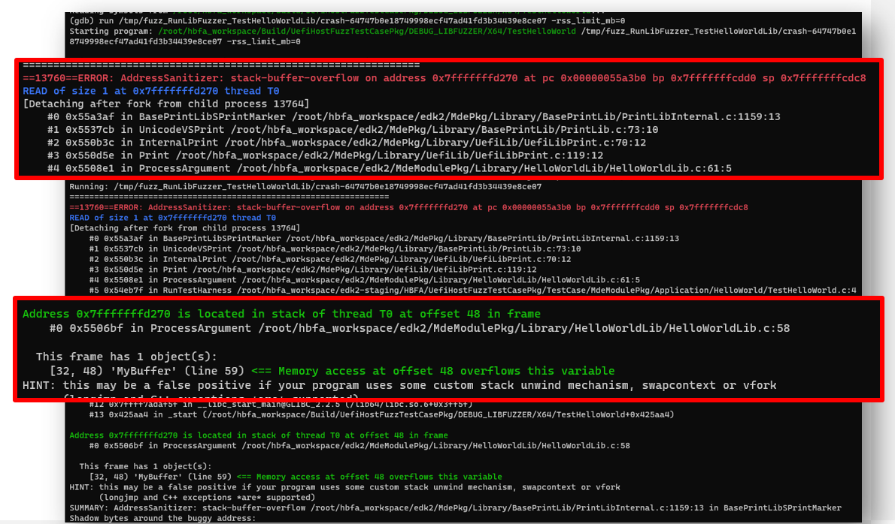
    <figcaption>Example of output from running crash case under debugger for TestHelloWorld, with important sections highlighted.</figcaption>
</figure>

### Debugging the crash

In order to help make the debugging for the crash more easily viewable, instead of debugging using our crash file from above, we'll simply create a file containing 'A' characters, and use this as our crash file input. The same fundamentals apply for debugging the actual crash file; however, your crash file bytes may slightly differ and this will provide the best repeatable approach for this tutorial. To create the new crash file, you can simply run a Python command and redirect output to a new file: /tmp/crash, as shown in the following:

```console
# python -c 'print("A"*46)' > /tmp/crash
```

Now when invoking the 'run' command in GDB, be sure to provide /tmp/crash as the argument, e.g.:

```console
(gdb) run /tmp/crash
```

In order to verify the stack overflow, we’ll need to identify and set a few break points. Since we did compile with debugging information, we can leverage the ‘list’ command in GDB to look around the source code, as built for the harness. First, we'll look around the ``ProcessArgument`` fuction.

<figure>
    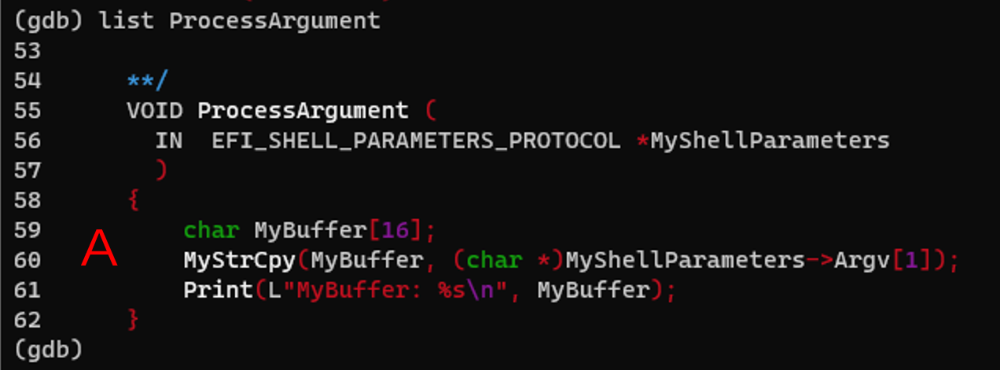
    <figcaption>Example of output from running GDB 'list ProcessArgument' for TestHelloWorld.</figcaption>
</figure>

Here, as shown near the label A, we run the ‘list ProcessArgument’ to examine code near that function. As shown, we can see the ‘MyBuffer’ identified in the ASAN output. Likewise, we see a suspicious ‘MyStrCpy’ command invoked at line 60, which appears to include arguments to the function call that reference MyBuffer and the shell parameters Argv array.

Next, we again use the 'list' command to inspect around the ``MyStrCpy`` function.

<figure>
    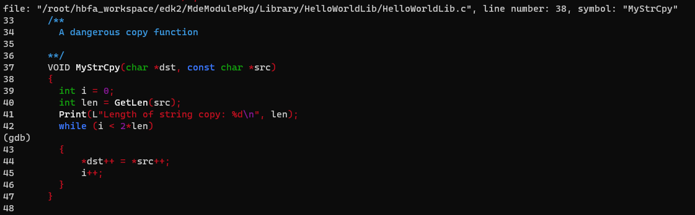
    <figcaption>Example of output from running GDB 'list MyStrCpy' for TestHelloWorld.</figcaption>
</figure>

To that end, we’ll want to set break points around the ``MyStrCpy`` function and examine what happens to MyBuffer. Here, we end up needing to set break points at lines 41, 44, and 61 for the HelloWorldLib.c file. Line 61 corresponds to just after the return from MyStrCpy shown near the label A in the first Figure. Because of ASAN instrumentation catching the overflow and redirecting code output, we won't actually reach this point. Nonetheless we'll include. Often you want to pin your break points around where you expect to reach; a sanitizer may not be in use and you would want to see the state after return. The breakpoint at Line 41 is just before the actual copy takes place into the MyBuffer array; this point was selected as it gave the best viewpoint for the present tutorial. We also select Line 44 as this is in a loop where the actual write from source to destination for the copied bytes is taking place. We can step through the copy, byte for byte.

The commands for setting these breakpoints are shown in the following.

```console
(gdb) b  /root/hbfa_workspace/edk2/MdeModulePkg/Library/HelloWorldLib/HelloWorldLib.c:41
Breakpoint 1 at 0x5505ef: /root/hbfa_workspace/edk2/MdeModulePkg/Library/HelloWorldLib/HelloWorldLib.c:41. (2 locations)
(gdb) b  /root/hbfa_workspace/edk2/MdeModulePkg/Library/HelloWorldLib/HelloWorldLib.c:44
Breakpoint 2 at 0x550620: /root/hbfa_workspace/edk2/MdeModulePkg/Library/HelloWorldLib/HelloWorldLib.c:44. (2 locations)
(gdb) b  /root/hbfa_workspace/edk2/MdeModulePkg/Library/HelloWorldLib/HelloWorldLib.c:61
Breakpoint 3 at 0x5508d6: file /root/hbfa_workspace/edk2/MdeModulePkg/Library/HelloWorldLib/HelloWorldLib.c, line 61.
(gdb) i b
Num     Type           Disp Enb Address            What
1       breakpoint     keep y   <MULTIPLE>
1.1                         y   0x00000000005505ef in MyStrCpy at /root/hbfa_workspace/edk2/MdeModulePkg/Library/HelloWorldLib/HelloWorldLib.c:41
1.2                         y   0x0000000000550833 in MyStrCpy at /root/hbfa_workspace/edk2/MdeModulePkg/Library/HelloWorldLib/HelloWorldLib.c:41
2       breakpoint     keep y   <MULTIPLE>
2.1                         y   0x0000000000550620 in MyStrCpy at /root/hbfa_workspace/edk2/MdeModulePkg/Library/HelloWorldLib/HelloWorldLib.c:44
2.2                         y   0x0000000000550860 in MyStrCpy at /root/hbfa_workspace/edk2/MdeModulePkg/Library/HelloWorldLib/HelloWorldLib.c:44
3       breakpoint     keep y   0x00000000005508d6 in ProcessArgument
                                                   at /root/hbfa_workspace/edk2/MdeModulePkg/Library/HelloWorldLib/HelloWorldLib.c:61
```

Next, we'll run the program and take a look at what is happening.

```console
(gdb) run /tmp/crash
Starting program: /root/hbfa_workspace/Build/UefiHostFuzzTestCasePkg/DEBUG_LIBFUZZER/X64/TestHelloWorld /tmp/crash

This GDB supports auto-downloading debuginfo from the following URLs:
https://debuginfod.fedoraproject.org/
Enable debuginfod for this session? (y or [n]) y
Debuginfod has been enabled.
To make this setting permanent, add 'set debuginfod enabled on' to .gdbinit.
[Thread debugging using libthread_db enabled]
Using host libthread_db library "/lib64/libthread_db.so.1".
INFO: Running with entropic power schedule (0xFF, 100).
INFO: Seed: 4077516461
INFO: Loaded 1 modules   (3888 inline 8-bit counters): 3888 [0x5e03c0, 0x5e12f0),
INFO: Loaded 1 PC tables (3888 PCs): 3888 [0x59fab8,0x5aedb8),
[New Thread 0x7ffff4bf9640 (LWP 532)]
/root/hbfa_workspace/Build/UefiHostFuzzTestCasePkg/DEBUG_LIBFUZZER/X64/TestHelloWorld: Running 1 inputs 1 time(s) each.
Running: /tmp/crash

Thread 1 "TestHelloWorld" hit Breakpoint 1, MyStrCpy (dst=0x7fffffffd320 "", src=0x606000000080 'A' <repeats 46 times>, "\n") at /root/hbfa_workspace/edk2/MdeModulePkg/Library/HelloWorldLib/HelloWorldLib.c:41
41        Print(L"Length of string copy: %d\n", len);
(gdb)```

Here, upon hitting the first breakpoint, we can see the memory addresses for the source (src) and destination (dst) arguments for the call into MyStrCpy. Taking a quick look at those, we see the following.

```console
(gdb) x/16x 0x606000000080
0x606000000080: 0x41414141      0x41414141      0x41414141      0x41414141
0x606000000090: 0x41414141      0x41414141      0x41414141      0x41414141
0x6060000000a0: 0x41414141      0x41414141      0x41414141      0x000a4141
0x6060000000b0: 0x00000000      0x00000000      0x00000000      0x00000000
(gdb) x/16x 0x7fffffffd320
0x7fffffffd320: 0x00000000      0x00000000      0xf7fb7ce0      0x00007fff
0x7fffffffd330: 0x00000000      0x00000000      0x00000000      0x00000000
0x7fffffffd340: 0x00000000      0x00000000      0x00000000      0x00000000
0x7fffffffd350: 0x00000000      0x00000000      0xffffd320      0x00007fff
```

As expected, at the source location (corresponding to a heap address), we see a buffer of 0x41 bytes ('A' characters). Likewise, at destination address (a stack address), we see that none of the bytes have been copied to our destination address. Next, we run 'c' for continue, and hit are breapkpiont at Line 44 of HelloWorldLib.c.  This is the location where the actual copy to the MyBuffer variable on the stack will occur. As shown in the screenshot below, when we first reach the breakpoint, there are Null bytes; nothing has been written. When we continue again, we hit the next pass in this loop and you can see one value 0x41 has been written to MyBuffer (note Endianess in the displayed bytes output from GDB).

<figure>
    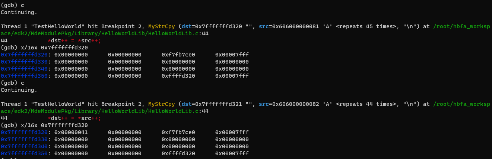
    <figcaption>Example of output from debugging copy of bytes in MyStrCpy when running TestHelloWorld.</figcaption>
</figure>
```

Next, we can keep running the 'c' (continue) command and step through the loop a few more times. As shown in the following screenshot, more bytes are written to MyBuffer.

<figure>
    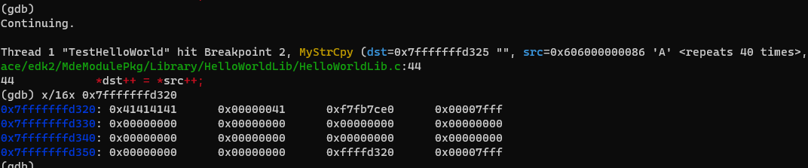
    <figcaption>Example of output from debugging copying of additional bytes in MyStrCpy when running TestHelloWorld.</figcaption>
</figure>

If we continue stepping, we'll eventually reach a point where the bytes have written past the 16 bytes allocated on the stack for MyBuffer and the ASAN error is caught. This is shown in the following screenshot.

<figure>
    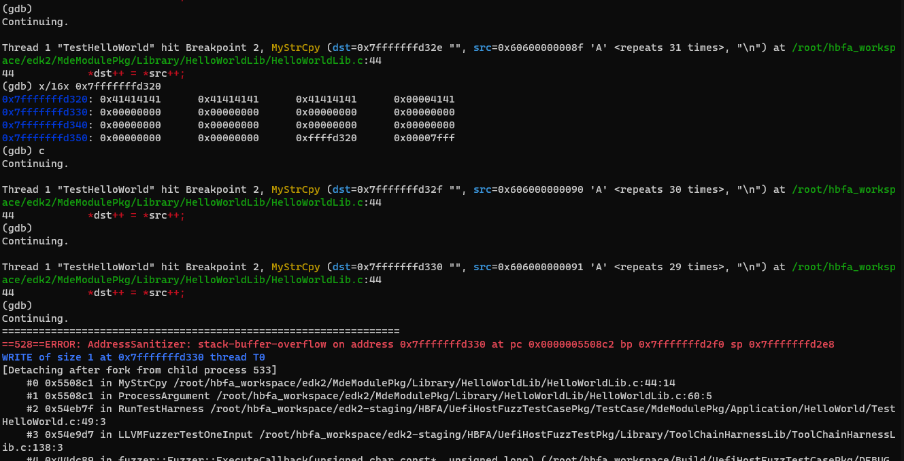
    <figcaption>Example of output from debugging copy of bytes in MyStrCpy and trigger an overflow detection when running TestHelloWorld.</figcaption>
</figure>

Thus we have verified that a buffer overflow is happening and have reached the completion of this tutorial. Thank you for taking the time to read these materials.

Return to [Summary](../SUMMARY.md)